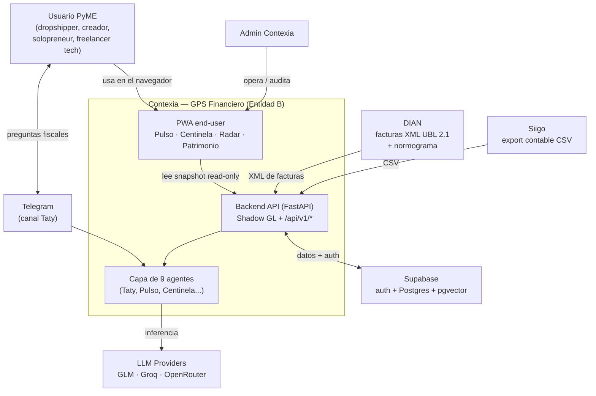

<!--
  CANONICAL — Product architecture for antigravity-app (Contexia MVP).
  This file is living memory for AI agents AND a founder-readable map.
  Precedence: identity/legal → .antigravity/GROUND_TRUTH.md wins.
  How agents work on this repo → HARNESS.md. What we build now → openspec/changes/.
  Update rule: touch a container or external dependency → update this file in the SAME change.
  English body (repo standard); the founder summary may be bilingual (see CLAUDE.md §2 carve-out).
-->

# Contexia — Arquitectura del producto (antigravity-app)

## Resumen para el fundador (léelo en 2 minutos)

Contexia es el **GPS Financiero** de una PyME: le dice, cada día, cuánta plata real tiene, qué debe a la DIAN y hacia dónde va. Técnicamente son **tres piezas**: (1) una **app web (PWA)** que el cliente abre en el navegador —ahí viven Pulso, Centinela Fiscal, Radar y Patrimonio—; (2) un **backend** (un servidor) que lee los datos contables ya cargados (facturas de la DIAN + export de Siigo), los convierte en un "libro mayor sombra" y calcula la Caja Real del día; (3) una **capa de agentes de IA** (Taty y compañía) que responde, vigila y alerta. La app está en Vercel (`contexia.online`), el backend en Railway, y los datos en Supabase. El **Búnker** es un panel interno-futuro (AI OS), **no** es el MVP del cliente.

> Contexia es la **Entidad B** (empresa TIC / AAA, no firma contable regulada). Ver [`.antigravity/GROUND_TRUTH.md`](.antigravity/GROUND_TRUTH.md) — manda en identidad y límites legales.

## Contexto del sistema (C4 Nivel 1)



## Contenedores (las piezas desplegables)

| Contenedor | Qué es | Stack | Dónde vive |
|---|---|---|---|
| **PWA end-user** | La app del cliente: Pulso/Overview, Centinela/Fiscal, Radar, Patrimonio, Flujo-detalle | Next.js 16 (static export) + React 19 + TS + Tailwind v4 | Vercel → `contexia.online` |
| **Búnker** (interno-futuro) | AI OS interno, **no** el MVP | Bundle en `app/bunker.html` + `app/dashboard-assets/` | Vercel (mismo repo, `/app/bunker`) |
| **Wizard** | Captación de leads | Next.js | Vercel (`contexia-wizard.vercel.app`) |
| **Backend API** | Shadow GL + endpoints `/api/v1/*` (financials, agents, approval queue, websocket, metrics, health) | FastAPI / Python 3.11 | Railway (`antigravity-app-production-175a`) |
| **Datos** | Auth + Postgres + pgvector; tablas Shadow GL | Supabase (`kpynymwghfwshvcvevxq`) | Supabase cloud |
| **Hermes** | Orquestador/scheduler de agentes + memoria aplicada | Nous Research native | **Local / WSL** (soberanía de datos) |

**Fuente canónica vs artefacto de build:** `contexia-app/` es la fuente de la PWA; la carpeta `app/` (raíz) es un **artefacto generado** (`npm run build` → sync `out/` → `app/`). **Nunca editar `app/` a mano.** (Ver CLAUDE.md §9.)

## Flujo estrella — Caja Real diaria (la promesa de venta)

```
Siigo CSV  ─┐
            ├─► ingesta ─► Shadow GL (erp_journal_entries / erp_journal_lines,
DIAN XML  ─┘                dian_xml_documents)  [Supabase, por tenant]
                                │
                                ▼
                  GET /api/v1/financials  (agrega por tenant Cliente Cero)
                    caja_real = balance cuenta 1110 (Bancos)
                    ventas_ayer / gastos_ayer = SOLO el día anterior
                    (COP en minor units / centavos)
                                │
                                ▼
                  PWA · CashTodayCard  (÷100 → COP, estados loading/error/empty/ready)
                                │
                                ▼
                  contexia.online/app/overview → "Caja Real de Hoy: $X"
```

- **Granularidad diaria = promesa de venta.** `ventas_ayer`/`gastos_ayer` son exclusivamente del día anterior, no un agregado mensual. Si el backend no tiene la granularidad, se arregla el backend, no el texto.
- **Multi-tenant**: `TenantContextMiddleware` resuelve `tenant_id` desde JWT; Cliente Cero vía `is_cliente_cero=true`. RLS en las tablas Shadow GL.
- **CORS**: la env var del backend DEBE llamarse `ALLOWED_ORIGINS` (incluir `https://contexia.online`). Un nombre distinto cae a un default localhost → preflight 400 → la PWA muestra estado de error. (Incidente resuelto 2026-06-30.)

## Stack y dependencias externas

- **Frontend**: Next.js 16 · React 19 · TypeScript estricto · Tailwind v4 · PWA (service worker versionado por deploy).
- **Backend**: FastAPI · Python 3.11 · pydantic-settings · slowapi (rate limit) · Supabase client (anon + service-role).
- **Datos**: Supabase Postgres + pgvector (RAG normograma DIAN). Shadow GL como libro mayor derivado.
- **IA**: routing híbrido — **GLM 5.2** interactivo (Taty/Radar/Auditoría/Maestro, <2s) + **Groq** fallback/batch (Centinela/Pulso/Social-Ops/KB); OpenRouter de respaldo.
- **Deploy**: Vercel (auto desde `main`) · Railway (auto desde `main`; arranque ~80s antes de servir).
- **Secretos**: Bitwarden (ver `docs/runbooks/secrets.md` si existe, o AGENTS.md).
- **Integraciones**: DIAN (XML UBL 2.1 + normograma), Siigo (CSV), Telegram (Taty), bancos (movimientos vía contable).

## Los 9 agentes

Catálogo canónico y detallado en [`AGENTES.md`](AGENTES.md) (confirmado por `openspec/config.yaml`). Resumen:
Centinela Fiscal · Pulso Diario · Radar Predictivo · Auditoría Sombra · Taty (operador conversacional) · Social Ops · KB · Orchestrator · Approval Queue (HITL gate). Orquestados por **Hermes** (local). Cómo trabajan los subagentes de desarrollo sobre este repo: ver [`HARNESS.md`](HARNESS.md).

## Decisiones asentadas (NO deshacer sin un ADR/decisión explícita)

1. **Hermes corre local/on-prem** (laptop/WSL), nunca VPS cloud — soberanía de datos financieros. Gateway-en-frente es imposible en Railway.
2. **Stage 11 (deploy a producción) es obligatorio** antes de archivar cualquier cambio OpenSpec.
3. **Supabase + RLS** es la capa de datos; el sharding se difiere hasta que el volumen de Cliente Cero lo justifique (Supabase = Postgres, no hay migración pendiente).
4. **Railway = FastAPI backend · Vercel = PWA.**
5. **`contexia-app/` es la fuente canónica de la PWA; `app/` es artefacto de build** — nunca editar a mano.
6. **Reglas del incidente 2026-06-29**: nunca desactivar type-checking, nunca fabricar stubs/placeholders para pasar un build, versionar el service worker por deploy (network-first en navegación).
7. **Routing LLM híbrido** GLM 5.2 interactivo + Groq fallback (los "8 perfiles Hermes" originales eran mock).
8. **CORS**: env var = `ALLOWED_ORIGINS` (fix 2026-06-30).

## Enlaces canónicos

- Identidad / legal / semántica → [`.antigravity/GROUND_TRUTH.md`](.antigravity/GROUND_TRUTH.md) (manda)
- Catálogo de agentes → [`AGENTES.md`](AGENTES.md)
- Cómo trabajan los agentes (harness + subagentes) → [`HARNESS.md`](HARNESS.md)
- Qué construimos ahora (deltas) → [`openspec/`](openspec/)
- Mapa del ecosistema completo → [`../ARCHITECTURE.md`](../ARCHITECTURE.md)
- Estándares → [`docs/backend-standards.md`](docs/backend-standards.md), [`docs/frontend-standards.md`](docs/frontend-standards.md)
