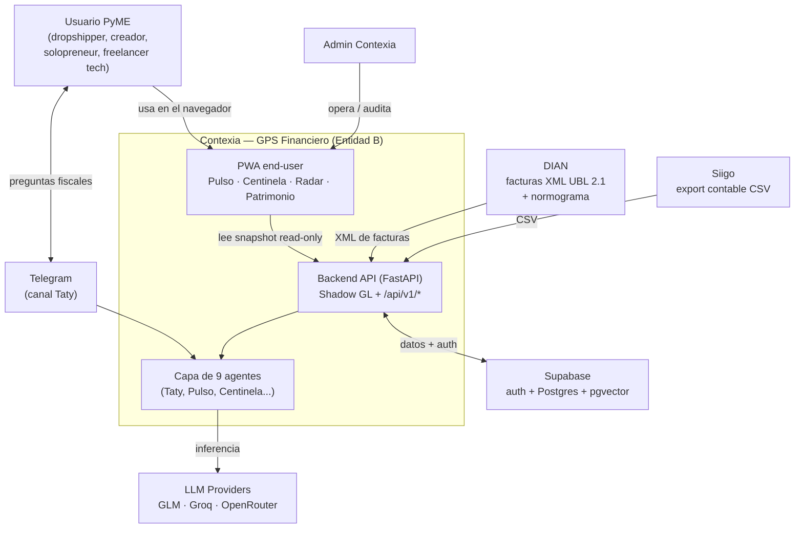

<!--
  CANONICAL — Product architecture for antigravity-app (Contexia MVP).
  This file is living memory for AI agents AND a founder-readable map.
  Precedence: identity/legal → .antigravity/GROUND_TRUTH.md wins.
  How agents work on this repo → HARNESS.md. What we build now → openspec/changes/.
  Update rule: touch a container or external dependency → update this file in the SAME change.
  English body (repo standard); the founder summary may be bilingual (see CLAUDE.md §2 carve-out).
-->

# Contexia — Arquitectura del producto (antigravity-app)

## Resumen para el fundador (léelo en 2 minutos)

Contexia es el **GPS Financiero** de una PyME: le dice, cada día, cuánta plata real tiene, qué debe a la DIAN y hacia dónde va. Técnicamente son **tres piezas**: (1) una **app web (PWA)** que el cliente abre en el navegador —ahí viven Pulso, Centinela Fiscal, Radar y Patrimonio—; (2) un **backend** (un servidor) que lee los datos contables ya cargados (facturas de la DIAN + export de Siigo), los convierte en un "libro mayor sombra" y calcula la Caja Real del día; (3) una **capa de agentes de IA** (Taty y compañía) que responde, vigila y alerta. La app está en Vercel (`contexia.online`), el backend en Railway, y los datos en Supabase. El **Búnker** es un panel interno-futuro (AI OS), **no** es el MVP del cliente.

> Contexia es la **Entidad B** (empresa TIC / AAA, no firma contable regulada). Ver [`.antigravity/GROUND_TRUTH.md`](.antigravity/GROUND_TRUTH.md) — manda en identidad y límites legales.

## Contexto del sistema (C4 Nivel 1)


```mermaid
flowchart TB
    user["Usuario PyME<br/>(dropshipper, creador,<br/>solopreneur, freelancer tech)"]
    admin["Admin Contexia"]

    subgraph contexia["Contexia — GPS Financiero (Entidad B)"]
        pwa["PWA end-user<br/>Pulso · Centinela · Radar · Patrimonio"]
        backend["Backend API (FastAPI)<br/>Shadow GL + /api/v1/*"]
        agents["Capa de 9 agentes<br/>(Taty, Pulso, Centinela...)"]
    end

    dian["DIAN<br/>facturas XML UBL 2.1<br/>+ normograma"]
    siigo["Siigo<br/>export contable CSV"]
    supa["Supabase<br/>auth + Postgres + pgvector"]
    llm["LLM Providers<br/>GLM · Groq · OpenRouter"]
    tg["Telegram<br/>(canal Taty)"]

    user -->|usa en el navegador| pwa
    admin -->|opera / audita| pwa
    pwa -->|lee snapshot read-only| backend
    dian -->|XML de facturas| backend
    siigo -->|CSV| backend
    backend <-->|datos + auth| supa
    agents -->|inferencia| llm
    user <-->|preguntas fiscales| tg
    tg --> agents
    backend --> agents
```

## Contenedores (las piezas desplegables)

| Contenedor | Qué es | Stack | Dónde vive |
|---|---|---|---|
| **PWA end-user** | La app del cliente: Pulso/Overview, Centinela/Fiscal, Radar, Patrimonio, Flujo-detalle | Next.js 16 (static export) + React 19 + TS + Tailwind v4 | Vercel → `contexia.online` |
| **Búnker** (interno-futuro) | AI OS interno, **no** el MVP | Bundle en `app/bunker.html` + `app/dashboard-assets/` | Vercel (mismo repo, `/app/bunker`) |
| **Wizard** | Captación de leads | Next.js | Vercel (`contexia-wizard.vercel.app`) |
| **Backend API** | Shadow GL + endpoints `/api/v1/*` (financials, agents, approval queue, websocket, metrics, health) | FastAPI / Python 3.11 | Railway (`antigravity-app-production-175a`) |
| **Datos** | Auth + Postgres + pgvector; tablas Shadow GL | Supabase (`kpynymwghfwshvcvevxq`) | Supabase cloud |
| **Hermes** | Orquestador/scheduler de agentes + memoria aplicada | Nous Research native | **Local / WSL** (soberanía de datos) |
| **GBrain** | Segundo cerebro: hybrid search (vector+keyword+expansión) + grafo de conocimiento auto-wired sobre `contexia-brain`; MCP server para Claude Code/Codex/Hermes | TypeScript/Bun (github.com/jpelaezcardenas/garrytan-gbrain), `gbrain-autopilot.service` (systemd) | **Local / WSL** (mismo host que Hermes) — proceso local, almacenamiento en esquema dedicado `gbrain` en el mismo proyecto Supabase (`kpynymwghfwshvcvevxq`) |
| **Chatwoot + bridge** | Inbox de WhatsApp (Meta Cloud API) para Taty, auto-hospedado; `apps/chatwoot-bridge/` (FastAPI) traduce eventos de Chatwoot ↔ Hermes Gateway (`taty-v1`), con pausa HITL vía etiqueta `bot_off` | Chatwoot (Docker Compose, `docker-compose.chatwoot.yml`) + FastAPI/Python 3.11 | **Local / laptop** (mismo host que Hermes, soberanía de datos) — nunca Vercel/Railway; requiere Docker Desktop (no instalado a la fecha, ver `openspec/changes/chatwoot-hermes-taty-bridge/`) |

**Fuente canónica vs artefacto de build:** `contexia-app/` es la fuente de la PWA; la carpeta `app/` (raíz) es un **artefacto generado** (`npm run build` → sync `out/` → `app/`). **Nunca editar `app/` a mano.** (Ver CLAUDE.md §9.)

> **EXCEPCIÓN VIGENTE (2026-06-30/07-01):** el cableado en vivo de Caja Real es un `<script>` insertado a mano en `app/overview.html` (commit `f91d9da`) y está EN PRODUCCIÓN. La UI completa del cliente solo existe como este export pre-construido — `contexia-app/` renderiza placeholders y NO puede reproducirla. **No regenerar `app/` desde `contexia-app/` ni revertir ese script** hasta reconciliar el source (follow-up durable); un rebuild+sync ciego borra la Caja Real en vivo. Detalle en CLAUDE.md §9.

## Flujo estrella — Caja Real diaria (la promesa de venta)

```
Siigo CSV  ─┐
            ├─► ingesta ─► Shadow GL (erp_journal_entries / erp_journal_lines,
DIAN XML  ─┘                dian_xml_documents)  [Supabase, por tenant]
                                │
                                ▼
                  GET /api/v1/financials  (agrega por el tenant del llamante —
                    per-tenant-client-access, 2026-07-22; cae a Cliente Cero
                    SOLO para la sesión de staging sin auth, nunca para un
                    cliente autenticado sin tenant resuelto — ver §Decisiones #13)
                    caja_real = balance cuenta 1110 (Bancos)
                    ventas_ayer / gastos_ayer = SOLO el día anterior
                    (COP en minor units / centavos)
                                │
                                ▼
                  PWA · CashTodayCard  (÷100 → COP, estados loading/error/empty/ready)
                                │
                                ▼
                  contexia.online/app/overview → "Caja Real de Hoy: $X"
```

- **Granularidad diaria = promesa de venta.** `ventas_ayer`/`gastos_ayer` son exclusivamente del día anterior, no un agregado mensual. Si el backend no tiene la granularidad, se arregla el backend, no el texto.
- **Multi-tenant**: `TenantContextMiddleware` resuelve `tenant_id` desde JWT; Cliente Cero vía `is_cliente_cero=true`. RLS en las tablas Shadow GL.
- **CORS**: la env var del backend DEBE llamarse `ALLOWED_ORIGINS` (incluir `https://contexia.online`). Un nombre distinto cae a un default localhost → preflight 400 → la PWA muestra estado de error. (Incidente resuelto 2026-06-30.)

## Stack y dependencias externas

- **Frontend**: Next.js 16 · React 19 · TypeScript estricto · Tailwind v4 · PWA (service worker versionado por deploy).
- **Backend**: FastAPI · Python 3.11 · pydantic-settings · slowapi (rate limit) · Supabase client (anon + service-role).
- **Datos**: Supabase Postgres + pgvector (RAG normograma DIAN). Shadow GL como libro mayor derivado.
- **IA**: routing híbrido — **GLM 5.2** interactivo (Taty/Radar/Auditoría/Maestro, <2s) + **Groq** fallback/batch (Centinela/Pulso/Social-Ops/KB); OpenRouter de respaldo.
- **Deploy**: Vercel (auto desde `main`) · Railway (auto desde `main`; arranque ~80s antes de servir).
- **Secretos**: Bitwarden (ver `docs/runbooks/secrets.md` si existe, o AGENTS.md).
- **Integraciones**: DIAN (XML UBL 2.1 + normograma), Siigo (CSV), Telegram (Taty), bancos (movimientos vía contable).

## Los 9 agentes

Catálogo canónico y detallado en [`AGENTES.md`](AGENTES.md) (confirmado por `openspec/config.yaml`). Resumen:
Centinela Fiscal · Pulso Diario · Radar Predictivo · Auditoría Sombra · Taty (operador conversacional) · Social Ops · KB · Orchestrator · Approval Queue (HITL gate). Orquestados por **Hermes** (local). Cómo trabajan los subagentes de desarrollo sobre este repo: ver [`HARNESS.md`](HARNESS.md).

## Decisiones asentadas (NO deshacer sin un ADR/decisión explícita)

1. **Hermes corre local/on-prem** (laptop/WSL), nunca VPS cloud — soberanía de datos financieros. Gateway-en-frente es imposible en Railway.
2. **Stage 11 (deploy a producción) es obligatorio** antes de archivar cualquier cambio OpenSpec.
3. **Supabase + RLS** es la capa de datos; el sharding se difiere hasta que el volumen de Cliente Cero lo justifique (Supabase = Postgres, no hay migración pendiente).
4. **Railway = FastAPI backend · Vercel = PWA.**
5. **`contexia-app/` es la fuente canónica de la PWA; `app/` es artefacto de build** — nunca editar a mano. **Excepción vigente:** el cableado en vivo de Caja Real vive como `<script>` hecho a mano en `app/overview.html` (en producción); no regenerar `app/` ni revertirlo hasta reconciliar el source (ver arriba + CLAUDE.md §9).
6. **Reglas del incidente 2026-06-29**: nunca desactivar type-checking, nunca fabricar stubs/placeholders para pasar un build, versionar el service worker por deploy (network-first en navegación).
7. **Routing LLM híbrido** GLM 5.2 interactivo + Groq fallback (los "8 perfiles Hermes" originales eran mock).
8. **CORS**: env var = `ALLOWED_ORIGINS` (fix 2026-06-30).
9. **`antigravity-app-production-175a` (proyecto Railway `elegant-success`) es el ÚNICO backend canónico**, confirmado por el rewrite `/api/v1/*` de `vercel.json`. Vercel apunta exclusivamente a `antigravity-app-production-175a.up.railway.app`. Una vez fue acompañado por un segundo proyecto Railway (`enthusiastic-youthfulness`, proyecto `-dc78`), pero ese proyecto **ya no recibe tráfico real y no es soporte de ninguna funcionalidad de Contexia** — sus 3 servicios (antigravity-app, trustworthy-art, function-bun) son stubs/scaffolds sin uso, última actividad mayo 2026. El proyecto `-dc78` puede ser decomisionado pero no es crítico ahora; ver `openspec/changes/archive/2026-07-05-reconcile-railway-antigravity-projects/` y `openspec/changes/archive/2026-07-05-remediate-gbrain-audit-findings/` (donde Bitwarden fue migrado a `-175a`).
10. **GBrain corre local/on-prem (WSL, junto a Hermes), nunca en Railway/cloud compute** — mismo principio que la decisión #1 para Hermes. Solo su almacenamiento (esquema `gbrain` dedicado en el Supabase existente) vive en la nube; el cómputo se queda soberano. Aislado por diseño de `public.knowledge_chunks`/`decision-vectorization` (esquema separado, nunca las mismas tablas) — ver `openspec/changes/archive/2026-07-05-adopt-gbrain-second-brain/`. **No existe instalación de GBrain en Windows nativo** — se eliminó (2026-07-05) tras confirmar que no se usaba y que representaba un segundo escritor al mismo esquema de producción con credencial en texto plano. `gbrain-autopilot.service` usa `Restart=always` (no `on-failure`) para autorecuperarse del circuit-breaker interno de GBrain que sale con status 0 — ver `openspec/changes/archive/2026-07-05-remediate-gbrain-audit-findings/`.
11. **El login demo-admin nunca hardcodea una contraseña real en código.** `apps/backend/application/auth_service.py` lee la contraseña del admin de demo desde `DEMO_ADMIN_PASSWORD` (env var, vacío por defecto = falla cerrado); `DEMO_AUTH_ENABLED` está explícitamente en `false` en producción (Railway). Incidente 2026-07-05: una contraseña maestra de Bitwarden estaba commiteada como esa contraseña y quedó expuesta en producción por default `True` sin override — ver `openspec/changes/archive/2026-07-05-remediate-gbrain-audit-findings/`.
12. **Bitwarden Secrets Manager está centralizado en el backend canónico `-175a`** — `secrets_provider.py` usa `BW_MASTER_PASSWORD`/`BW_CLIENT_ID`/`BW_CLIENT_SECRET` para acceder al vault, env-var gated, nunca hardcodeados. La contraseña maestra fue rotada 2026-07-05 de `Lindafea0712*` → `Lindafea0712!` (fuera de banda). Futuro: migrar a Bitwarden Secrets Manager (BWS access-token) para reemplazar el `bw unlock` basado en master-password; ver `task_d1ec7639` (Bitwarden Secrets Manager migration).
13. **Cada cliente B2B tiene su propio tenant** (no comparten el de Cliente Cero) — `GET /api/v1/financials` resuelve el tenant del que llama vía `resolved_tenant_id` (`core/identity_resolver.py`, membresía activa en `user_tenants`). Cae a Cliente Cero únicamente para la identidad de staging sin auth (`AUTH_ENFORCED=False`, sin token); un cliente autenticado cuyo tenant no resuelve recibe un snapshot vacío, **nunca** los datos de Cliente Cero — ver `openspec/changes/per-tenant-client-access/`. Los tokens de sesión de Supabase se firman de forma asimétrica (ES256 + JWKS, no el secreto compartido HS256 legacy) — `core/deps.py::_verify_supabase_token` verifica ambos esquemas (encontrado y corregido en vivo 2026-07-22; sin este fix ningún login de cliente real funcionaba, aunque todo lo demás estuviera bien).
14. **Approval Queue sigue el mismo patrón de tenant-scoping de Decisión #13** (2026-07-23) — los 4 endpoints `/api/v1/approval-queue/*` (list/enqueue/approve/reject) resuelven el tenant del caller vía el helper compartido `core/tenant_context.py::resolve_request_tenant_scope(user, client)`, no duplicado de `identity_resolver`. Un caller cuyo tenant resuelto es Cliente Cero se trata como **operador Contexia**: ve y actúa sobre la cola de todos los tenants (decisión HITL del fundador, registrada en `openspec/changes/approval-queue-tenant-scoping/design.md`), en vez de recibir el trato de "cliente sin tenant → vacío" de la Decisión #13. Un cliente B2B normal solo ve/opera su propia cola; un caller autenticado sin tenant resuelto nunca cae a Cliente Cero (lista vacía en lectura, 403 en escritura). `enqueue_draft`/`approve_draft`/`reject_draft` exigen `tenant_id` explícito — sin default silencioso. `approval_queue.tenant_id` pasa a `NOT NULL` sin default (migración `0033`, aplicada en vivo 2026-07-23 con confirmación explícita del fundador — verificado: `column_default IS NULL`, `is_nullable = 'NO'`). Pendiente documentado (no bloqueante): retirar la política RLS permisiva `approval_queue_anon_all` (propiedad de `hermes-multi-tenant-wrapper`) y refactorizar `financials_endpoints.py` para reusar `resolve_request_tenant_scope` en vez de su resolución propia — ver `design.md` §"Out of scope".
15. **Centinela sigue el mismo patrón de tenant-scoping de Decisión #13** (2026-07-23) — `POST /api/v1/centinela/evaluate` y `GET /api/v1/centinela/alerts/{company_id}` resuelven el tenant del llamador vía `core/tenant_context.py::resolve_caller_tenant()` (helper independiente y más simple que `resolve_request_tenant_scope` de la Decisión #14 — Centinela no tiene el caso de vista-de-operador-sobre-todos-los-tenants; reconciliar ambos helpers en un único contrato queda como follow-up, no hecho en este cambio). `CentinelaService.save_alerts()` exige `tenant_id` explícito y lanza `TenantResolutionError` si falta (fail-loud — Cliente Cero jamás se estampa por defecto). Un cliente autenticado sin tenant resuelto puede evaluar pero **no persiste** alertas (`save_skipped_reason="tenant_unresolved"`) y lee una lista vacía. `radar_service.py`/`pulso_diario_service.py` también corrigen sus lecturas de `centinela_alerts` para filtrar por `tenant_id` (Pulso tenía un bug real: filtraba `company_id` con el UUID del tenant, que nunca daba match). Migración `0034_rescope_centinela_alerts_tenant.sql` (renombrada de `0033` — colisión de numeración detectada 2026-07-23 con la migración `0033_approval_queue_tenant_not_null.sql` de la Decisión #14, generada por dos sesiones paralelas sin coordinación) propuesta para las ~40 alertas históricas mal-estampadas — **no aplicada**, requiere aprobación del fundador — ver `openspec/changes/archive/2026-07-23-centinela-tenant-scoped-alerts/`.
16. **Taty (`POST`/`GET /api/v1/agents/ask`) sigue el mismo patrón de tenant-scoping de Decisión #13** (2026-07-23) — antes resolvía el perfil del cliente contra un dict hardcodeado de 3 claves demo (`AGENT_PROFILES`) y el endpoint no tenía autenticación (`company_id` en el body, sin verificar, spoofable). Ahora: `Depends(get_current_user)` + resolución de 3 vías idéntica a Decisión #13 (`resolved_tenant_id` propio → tenant propio; identidad de staging → Cliente Cero; autenticado sin tenant resuelto → error en banda `error_code="tenant_not_resolved"`, **nunca** Cliente Cero). El perfil de Taty (`taty_service.py::_get_tenant_profile`) se deriva dinámicamente de `tenants.legal_name`/`nit`, sin tabla nueva ni paso de aprovisionamiento por cliente — cualquiera de los 10 clientes B2B provisionados usa Taty sin tocar código. `taty_intent_router.py` (código muerto, sin caller vivo) fue eliminado, igual que la ruta duplicada `POST /api/v1/agents/taty/ask`. El régimen tributario ("Régimen Común") ya no se asume para un cliente desconocido — se omite del prompt si no está confirmado (`.antigravity/GROUND_TRUTH.md`). Verificado en vivo en producción: ruta eliminada → 404, `/agents/ask` sin auth → 401. **Pendiente del fundador (no bloquea el cierre):** verificación end-to-end con login real de un cliente provisionado (11.6/11.6b) y confirmación de que el chat de Telegram de Cliente Cero sigue respondiendo (11.8) — este agente no maneja credenciales en texto plano — ver `openspec/changes/archive/2026-07-23-taty-per-tenant-profiles/`.

## Enlaces canónicos

- Identidad / legal / semántica → [`.antigravity/GROUND_TRUTH.md`](.antigravity/GROUND_TRUTH.md) (manda)
- Catálogo de agentes → [`AGENTES.md`](AGENTES.md)
- Cómo trabajan los agentes (harness + subagentes) → [`HARNESS.md`](HARNESS.md)
- Qué construimos ahora (deltas) → [`openspec/`](openspec/)
- Mapa del ecosistema completo → [`../ARCHITECTURE.md`](../ARCHITECTURE.md)
- Estándares → [`docs/backend-standards.md`](docs/backend-standards.md), [`docs/frontend-standards.md`](docs/frontend-standards.md)
