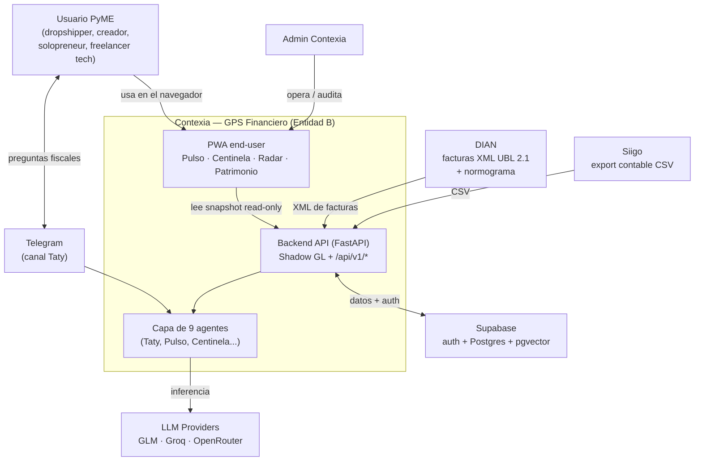

<!--
  CANONICAL — Product architecture for antigravity-app (Contexia MVP).
  This file is living memory for AI agents AND a founder-readable map.
  Precedence: identity/legal → .antigravity/GROUND_TRUTH.md wins.
  How agents work on this repo → HARNESS.md. What we build now → openspec/changes/.
  Update rule: touch a container or external dependency → update this file in the SAME change.
  English body (repo standard); the founder summary may be bilingual (see CLAUDE.md §2 carve-out).
-->

# Contexia — Arquitectura del producto (antigravity-app)

## Resumen para el fundador (léelo en 2 minutos)

Contexia es el **GPS Financiero** de una PyME: le dice, cada día, cuánta plata real tiene, qué debe a la DIAN y hacia dónde va. Técnicamente son **tres piezas**: (1) una **app web (PWA)** que el cliente abre en el navegador —ahí viven Pulso, Centinela Fiscal, Radar y Patrimonio—; (2) un **backend** (un servidor) que lee los datos contables ya cargados (facturas de la DIAN + export de Siigo), los convierte en un "libro mayor sombra" y calcula la Caja Real del día; (3) una **capa de agentes de IA** (Taty y compañía) que responde, vigila y alerta. La app está en Vercel (`contexia.online`), el backend en Railway, y los datos en Supabase. El **Búnker** es el panel de administración (AI OS) para el equipo Contexia y, con secciones filtradas por rol, también para clientes B2B.

> Contexia es la **Entidad B** (empresa TIC / AAA, no firma contable regulada). Ver [`.antigravity/GROUND_TRUTH.md`](.antigravity/GROUND_TRUTH.md) — manda en identidad y límites legales.

## Contexto del sistema (C4 Nivel 1)


```mermaid
flowchart TB
    user["Usuario PyME<br/>(dropshipper, creador,<br/>solopreneur, freelancer tech)"]
    admin["Admin Contexia"]

    subgraph contexia["Contexia — GPS Financiero (Entidad B)"]
        pwa["PWA end-user<br/>Pulso · Centinela · Radar · Patrimonio"]
        backend["Backend API (FastAPI)<br/>Shadow GL + /api/v1/*"]
        agents["Capa de 9 agentes<br/>(Taty, Pulso, Centinela...)"]
    end

    dian["DIAN<br/>facturas XML UBL 2.1<br/>+ normograma"]
    siigo["Siigo<br/>export contable CSV"]
    supa["Supabase<br/>auth + Postgres + pgvector"]
    llm["LLM Providers<br/>GLM · Groq · OpenRouter"]
    tg["Telegram<br/>(canal Taty)"]

    user -->|usa en el navegador| pwa
    admin -->|opera / audita| pwa
    pwa -->|lee snapshot read-only| backend
    dian -->|XML de facturas| backend
    siigo -->|CSV| backend
    backend <-->|datos + auth| supa
    agents -->|inferencia| llm
    user <-->|preguntas fiscales| tg
    tg --> agents
    backend --> agents
```

## Contenedores (las piezas desplegables)

| Contenedor | Qué es | Stack | Dónde vive |
|---|---|---|---|
| **PWA end-user** | La app del cliente: Pulso/Overview, Centinela/Fiscal, Radar, Patrimonio, Flujo-detalle | Next.js 16 (static export) + React 19 + TS + Tailwind v4 | Vercel → `contexia.online` |
| **Búnker** | Panel de administración EN PRODUCCIÓN — 7 secciones (Dashboard, CRM/Ventas, Social Content Ops, Onboarding, Sell Machine, Agentic OS, Configuración), filtradas por rol: admin ve todas, cliente B2B ve Dashboard + Agentic OS + Configuración | Next.js 16 (static export) + React 19 + TS + Tailwind v4, misma fuente que la PWA (`contexia-app/`) | Vercel (mismo repo, `/app/bunker`) |
| **Wizard** | Captación de leads | Next.js | Vercel (`contexia-wizard.vercel.app`) |
| **Backend API** | Shadow GL + endpoints `/api/v1/*` (financials, agents, approval queue, websocket, metrics, health) | FastAPI / Python 3.11 | Railway (`antigravity-app-production-175a`) |
| **Datos** | Auth + Postgres + pgvector; tablas Shadow GL | Supabase (`kpynymwghfwshvcvevxq`) | Supabase cloud |
| **Hermes** | Orquestador/scheduler de agentes + memoria aplicada | Nous Research native | **Local / WSL** (soberanía de datos) |
| **GBrain** | Segundo cerebro: hybrid search (vector+keyword+expansión) + grafo de conocimiento auto-wired sobre `contexia-brain`; MCP server para Claude Code/Codex/Hermes | TypeScript/Bun (github.com/jpelaezcardenas/garrytan-gbrain), `gbrain-autopilot.service` (systemd) | **Local / WSL** (mismo host que Hermes) — proceso local, almacenamiento en esquema dedicado `gbrain` en el mismo proyecto Supabase (`kpynymwghfwshvcvevxq`) |
| **Hermes-HubSpot poller** | Sync unidireccional Supabase → HubSpot (free tier): `crm_leads` → Contacts + Deals en el único pipeline gratis (funnel Renta Natural B2C); `b2b_clients` → Companies solo lectura, nunca Deals. Ver `openspec/changes/hubspot-sync-renta-natural/` | `apps/hermes-hubspot-poller/` (Python/httpx), scheduled task cada 5 min | **Local / laptop** (mismo host que Hermes) — el Private App Access Token de HubSpot y la service-role key de Supabase nunca llegan a Railway/Vercel |
| **Hermes-Siigo poller** | Sync unidireccional **de solo lectura** Siigo → Shadow GL: cada noche a las 2 AM pide journals + invoices de la API REST de Siigo por cada tenant con credenciales y los ingesta vía `POST /internal/siigo-sync/run`. Nunca escribe de vuelta al Siigo del cliente. Ver `openspec/changes/real-data-ingestion-mvp/` | `apps/hermes-siigo-poller/` (Python/httpx), scheduled task diaria | **Local / laptop** (mismo host que Hermes) — `INTERNAL_API_KEY` y la lista de tenants viven en su `.env` local; las credenciales Siigo por tenant viven **solo** en env vars de Railway (`SIIGO_USERNAME_<tenant>`/`SIIGO_ACCESS_KEY_<tenant>`), nunca en git ni en Supabase |
| **Hermes-Gmail poller** | Ingesta de adjuntos: cada 15 min lee el inbox de Taty, resuelve el remitente a un tenant vía la tabla `gmail_sender_map` y sube cada adjunto soportado (CSV/XLSX/XML/PDF) a `POST /internal/ingest/file`. Marca el correo `contexia-processed` **solo** si todos sus adjuntos ingestaron bien; un remitente sin mapear se salta sin etiquetar, así queda reintentable. Ver `openspec/changes/real-data-ingestion-mvp/` | `apps/hermes-gmail-poller/` (Python/httpx + Gmail API v1 OAuth2), scheduled task cada 15 min | **Local / laptop** (mismo host que Hermes) — el token OAuth de Gmail, `credentials.json` y la service-role key de Supabase nunca llegan a Railway/Vercel |
| **Chatwoot + bridge** | Inbox real de WhatsApp (Meta Cloud API) para Taty — inbox `1` ("Taty Contadora Amiga 24/7", `Channel::Whatsapp`; el inbox `3` es `Channel::Api`, solo pruebas/inyección, sin credenciales Meta). `apps/chatwoot-bridge/` (FastAPI) es una capa de transporte delgada: reenvía al backend (`POST /channels/whatsapp/leads/{id}/reply`, que enruta a `taty_lead_router` → `TatyAgentService` — un solo cerebro, el mismo que Telegram/PWA) y Chatwoot entrega la respuesta al cliente real (`deliver=false` en esa llamada evita el doble envío). Pausa HITL vía etiqueta `bot_off` | Chatwoot (Docker Compose, `docker-compose.chatwoot.yml`) + FastAPI/Python 3.11, corre como Scheduled Task de Windows (`ContexiaChatwootBridge`, watchdog de 1 min) | **Local / laptop** (mismo host que Hermes, soberanía de datos) — nunca Vercel/Railway. Docker Desktop instalado y corriendo desde `chatwoot-hermes-taty-bridge`; ver `taty-whatsapp-renta-sales-capability` para el cableado actual al cerebro compartido de Taty |
| **VoiceBox** | Proveedor de voz **local** (TTS con clonación de voz + STT). Sirve a dos consumidores: los agentes de Hermes (vía proveedor `tts` `type: command` o su MCP) y la nota de voz saliente de Taty por WhatsApp. La síntesis ocurre 100% on-prem — el modelo, el perfil de voz clonada y el texto del cliente nunca salen de la máquina; solo los bytes OGG terminados cruzan al backend, que hace el envío Graph que Railway sí puede alcanzar. **Estado: integrado y APAGADO** (`VOICE_ENABLED=false` en backend y bridge) — este portátil es CPU-only y tarda 3-5 min por frase. Ver `docs/integrations/voicebox.md` | VoiceBox v0.5.0 (MIT, upstream `jamiepine/voicebox`), REST en `:17493`, motor Qwen3-TTS 0.6B; `ffmpeg` para WAV→OGG/Opus | **Local / nodo de inferencia** (Ryzen 7 + RTX 4070 Ti Super, aún no existe) — misma soberanía de datos que Hermes/GBrain/pollers, nunca Vercel/Railway |

**Fuente canónica vs artefacto de build:** `contexia-app/` es la fuente de la PWA; la carpeta `app/` (raíz) es un **artefacto generado** (`npm run build` → sync `out/` → `app/`). **Nunca editar `app/` a mano.** (Ver CLAUDE.md §9.)

> **EXCEPCIÓN RETIRADA (2026-07-01):** el cableado en vivo de Caja Real fue reconciliado al source React (`CashTodayCard`). `contexia-app/` es ahora la fuente completa y reproducible de la PWA. `app/` es de nuevo un artefacto de build limpio. Detalle en CLAUDE.md §9.

## Flujo estrella — Caja Real diaria (la promesa de venta)

```
Siigo CSV  ─┐
            ├─► ingesta ─► Shadow GL (erp_journal_entries / erp_journal_lines,
DIAN XML  ─┘                dian_xml_documents)  [Supabase, por tenant]
                                │
                                ▼
                  GET /api/v1/financials  (agrega por el tenant del llamante —
                    per-tenant-client-access, 2026-07-22; cae a Cliente Cero
                    SOLO para la sesión de staging sin auth, nunca para un
                    cliente autenticado sin tenant resuelto — ver §Decisiones #13)
                    caja_real = balance cuenta 1110 (Bancos)
                    ventas_ayer / gastos_ayer = SOLO el día anterior
                    (COP en minor units / centavos)
                                │
                                ▼
                  PWA · CashTodayCard  (÷100 → COP, estados loading/error/empty/ready)
                                │
                                ▼
                  contexia.online/app/overview → "Caja Real de Hoy: $X"
```

- **Granularidad diaria = promesa de venta.** `ventas_ayer`/`gastos_ayer` son exclusivamente del día anterior, no un agregado mensual. Si el backend no tiene la granularidad, se arregla el backend, no el texto.
- **Multi-tenant**: `TenantContextMiddleware` resuelve `tenant_id` desde JWT; Cliente Cero vía `is_cliente_cero=true`. RLS en las tablas Shadow GL.
- **CORS**: la env var del backend DEBE llamarse `ALLOWED_ORIGINS` (incluir `https://contexia.online`). Un nombre distinto cae a un default localhost → preflight 400 → la PWA muestra estado de error. (Incidente resuelto 2026-06-30.)
- **Hermanos de `/financials` (misma política de tenant, mismo Shadow GL)**: `GET /api/v1/centinela/alerts` (Pulso · `ActiveAlerts`) y `GET /api/v1/financials/liquidity-bridge` (Flujo-detalle · `MonthlyLiquidityBridgeCard`) — ambos añadidos en `pwa-tenant-aware-screens` (2026-07-23), resuelven el tenant con el mismo helper (`resolve_caller_tenant_id`) que `/financials`. El puente de liquidez es mensual (no diario) y deriva del mismo `erp_journal_lines`/cuenta `1110`.
- **Radar de Caja — proyección a 13 semanas** (`radar-cash-projection-13w`, 2026-09-04): `GET /api/v1/radar/proyeccion-caja` (Radar · `CashProjection13wCard`) extiende el mismo Shadow GL hacia adelante — parte del balance acumulado de la cuenta `1110` (reusa `financials_service._compute_caja_real_balance`, no lo re-deriva) y lo proyecta semana a semana con la tendencia de flujo neto de las últimas 12 semanas. Resuelve el tenant con `resolve_request_tenant_scope()` (Decisión #17), **sin** query param — a diferencia del endpoint hermano legacy `GET /api/v1/radar/risk-score`, que conserva su `tenant_id` por query por razones históricas y no debe copiarse. **Límites declarados en la propia respuesta, no solo en docs:** `metodologia` es siempre `"solo_historico"` (no existen tablas de CxC/CxP con vencimiento en el modelo de datos), `impuesto_futuro_estimado` es siempre `null` (no hay cálculo real de impuesto futuro en el backend — prohibido mockearlo), la confianza solo tiene bandas `"media"` (sem 1-4) y `"baja"` (sem 5-13) — **nunca `"alta"`** —, y un tenant con menos de 4 semanas de historial recibe `estado: "sin_historico_suficiente"` en vez de una proyección inventada. Es de solo lectura para el cliente: no encola nada en `approval_queue` ni ejecuta ninguna acción financiera. **Única excepción, deliberada** (`radar-adoption-tracking`, 2026-09-05): una lectura exitosa graba una fila de telemetría en `radar_module_opens` (una por tenant/usuario/día, con RLS realmente tenant-scoped, no `USING (true)`), que alimenta el KPI de adopción semanal. La escritura usa el cliente service-role y es best-effort: si falla, se registra en el log y la proyección se devuelve igual — la telemetría nunca degrada una lectura financiera.

## Stack y dependencias externas

- **Frontend**: Next.js 16 · React 19 · TypeScript estricto · Tailwind v4 · PWA (service worker versionado por deploy).
- **Backend**: FastAPI · Python 3.11 · pydantic-settings · slowapi (rate limit) · Supabase client (anon + service-role).
- **Datos**: Supabase Postgres + pgvector (RAG normograma DIAN). Shadow GL como libro mayor derivado.
- **IA**: cascada de failover 100% gratis — **Groq** (`openai/gpt-oss-120b`, primario) → **OpenRouter free** (`nvidia/nemotron-3-super-120b-a12b:free`) → **Cerebras** (`gpt-oss-120b`) → **NVIDIA NIM** (`llama-3.3-70b-instruct`). Ver `apps/backend/agents/llm_engine.py`. MiMo (plan de pago que sí usa Hermes/Houston) está deliberadamente excluido del backend: su ToS prohíbe uso en "application backends" — usarlo aquí arriesga suspender el mismo key compartido con Hermes/Houston.
  **Estado real verificado en vivo 2026-08-28 contra las keys de Railway (`elegant-success`/production):** Groq, OpenRouter free y **NVIDIA NIM** (`openai/gpt-oss-120b`, key nueva agregada a Railway) responden — 3 de 4 escalones reales. **Cerebras sigue muerto** (`402 Payment required`) incluso con una key nueva generada el mismo día — confirmado que es la cuenta (falta activar/pagar el tier), no la key ni el código; pendiente del fundador en el dashboard de Cerebras. El modelo de NVIDIA también tuvo que corregirse en el camino: `meta/llama-3.3-70b-instruct` fue retirado el 2026-08-26 (`410 Gone`).
- **Deploy**: Vercel (auto desde `main`) · Railway (auto desde `main`; arranque ~80s antes de servir).
- **Secretos**: Bitwarden (ver `docs/runbooks/secrets.md` si existe, o AGENTS.md).
- **Integraciones**: DIAN (XML UBL 2.1 + normograma), Siigo (**CSV export y API REST** — `api.siigo.com`, solo lectura, requiere header `Partner-Id` registrado vía `SIIGO_PARTNER_ID`), **Gmail API v1** (OAuth2 local, solo lectura de adjuntos + etiquetado), Telegram (Taty), bancos (movimientos vía contable).
- **Parsing de archivos**: `openpyxl` (Excel) y `pypdf` (PDF: extracción de XML embebido y de texto) — agregados en `real-data-ingestion-mvp`.

## Los 9 agentes

Catálogo canónico y detallado en [`AGENTES.md`](AGENTES.md) (confirmado por `openspec/config.yaml`). Resumen:
Centinela Fiscal · Pulso Diario · Radar Predictivo · Auditoría Sombra · Taty (operador conversacional) · Social Ops · KB · Orchestrator · Approval Queue (HITL gate). Orquestados por **Hermes** (local). Cómo trabajan los subagentes de desarrollo sobre este repo: ver [`HARNESS.md`](HARNESS.md).

## Decisiones asentadas (NO deshacer sin un ADR/decisión explícita)

1. **Hermes corre local/on-prem** (laptop/WSL), nunca VPS cloud — soberanía de datos financieros. Gateway-en-frente es imposible en Railway.
2. **Stage 11 (deploy a producción) es obligatorio** antes de archivar cualquier cambio OpenSpec.
3. **Supabase + RLS** es la capa de datos; el sharding se difiere hasta que el volumen de Cliente Cero lo justifique (Supabase = Postgres, no hay migración pendiente).
4. **Railway = FastAPI backend · Vercel = PWA.**
5. **`contexia-app/` es la fuente canónica de la PWA; `app/` es artefacto de build** — nunca editar a mano. La excepción de Caja Real fue **retirada** (2026-07-01): `CashTodayCard` integra el fetch en React, `contexia-app/` reproduce la UI completa (ver CLAUDE.md §9).
6. **Reglas del incidente 2026-06-29**: nunca desactivar type-checking, nunca fabricar stubs/placeholders para pasar un build, versionar el service worker por deploy (network-first en navegación).
7. **Routing LLM del backend = cascada 100% gratis** (2026-08-27, reemplaza el routing híbrido GLM 5.2/Groq original — los "8 perfiles Hermes" de esa versión ya eran mock). Groq → Cerebras → OpenRouter free → NVIDIA NIM, sin ningún proveedor de pago en el path por defecto. GLM y MiniMax M3 fueron evaluados y descartados como primary/fallback pagado porque el backend no estaba dispuesto a pagarlos de forma sostenida; MiMo (el plan que sí paga Contexia, usado en Hermes/Houston) queda fuera del backend por restricción de ToS (uso interactivo únicamente, no "application backends") — ver `openspec/changes/` o memoria de sesión 2026-08-25/27 para el detalle de la migración.
8. **CORS**: env var = `ALLOWED_ORIGINS` (fix 2026-06-30).
9. **`antigravity-app-production-175a` (proyecto Railway `elegant-success`) es el ÚNICO backend canónico**, confirmado por el rewrite `/api/v1/*` de `vercel.json`. Vercel apunta exclusivamente a `antigravity-app-production-175a.up.railway.app`. Una vez fue acompañado por un segundo proyecto Railway (`enthusiastic-youthfulness`, proyecto `-dc78`), pero ese proyecto **ya no recibe tráfico real y no es soporte de ninguna funcionalidad de Contexia** — sus 3 servicios (antigravity-app, trustworthy-art, function-bun) son stubs/scaffolds sin uso, última actividad mayo 2026. El proyecto `-dc78` puede ser decomisionado pero no es crítico ahora; ver `openspec/changes/archive/2026-07-05-reconcile-railway-antigravity-projects/` y `openspec/changes/archive/2026-07-05-remediate-gbrain-audit-findings/` (donde Bitwarden fue migrado a `-175a`).
10. **GBrain corre local/on-prem (WSL, junto a Hermes), nunca en Railway/cloud compute** — mismo principio que la decisión #1 para Hermes. Solo su almacenamiento (esquema `gbrain` dedicado en el Supabase existente) vive en la nube; el cómputo se queda soberano. Aislado por diseño de `public.knowledge_chunks`/`decision-vectorization` (esquema separado, nunca las mismas tablas) — ver `openspec/changes/archive/2026-07-05-adopt-gbrain-second-brain/`. **No existe instalación de GBrain en Windows nativo** — se eliminó (2026-07-05) tras confirmar que no se usaba y que representaba un segundo escritor al mismo esquema de producción con credencial en texto plano. `gbrain-autopilot.service` usa `Restart=always` (no `on-failure`) para autorecuperarse del circuit-breaker interno de GBrain que sale con status 0 — ver `openspec/changes/archive/2026-07-05-remediate-gbrain-audit-findings/`.
11. **El login demo-admin nunca hardcodea una contraseña real en código.** `apps/backend/application/auth_service.py` lee la contraseña del admin de demo desde `DEMO_ADMIN_PASSWORD` (env var, vacío por defecto = falla cerrado); `DEMO_AUTH_ENABLED` está explícitamente en `false` en producción (Railway). Incidente 2026-07-05: una contraseña maestra de Bitwarden estaba commiteada como esa contraseña y quedó expuesta en producción por default `True` sin override — ver `openspec/changes/archive/2026-07-05-remediate-gbrain-audit-findings/`.
12. **Bitwarden Secrets Manager está centralizado en el backend canónico `-175a`** — `secrets_provider.py` usa `BW_MASTER_PASSWORD`/`BW_CLIENT_ID`/`BW_CLIENT_SECRET` para acceder al vault, env-var gated, nunca hardcodeados. La contraseña maestra fue rotada fuera de banda el 2026-07-05; **su valor NO se documenta aquí ni en ningún archivo del repo** (ver la regla de abajo). Futuro: migrar a Bitwarden Secrets Manager (BWS access-token) para reemplazar el `bw unlock` basado en master-password; ver `task_d1ec7639` (Bitwarden Secrets Manager migration).

    **Regla dura (2026-08-25):** ningún valor de credencial —contraseña maestra, token, API key— se escribe jamás en un archivo versionado, incluidos los docs de canon, los reports de OpenSpec y las notas de sesión. Se nombra la variable (`BW_MASTER_PASSWORD`), nunca el valor. Esta regla nació de encontrar la contraseña maestra vigente de Bitwarden en texto plano en esta misma línea, en un documento que se auto-carga en cada sesión de agente. Los valores viven solo en el vault y en las env vars de Railway.

    **Keeper: RETIRADO (legacy, no se usa).** Keeper fue el gestor de secretos anterior. Fue **reemplazado íntegramente por Bitwarden Cloud** en `keeper-migration-2026-06-15` (archivado 2026-08-13). No queda ninguna referencia a Keeper en el código: `core/secrets_provider.py` solo implementa `BitwardenCloudProvider` y `VaultwardenProvider`. Verificado en vivo 2026-08-25: `GET /api/v1/secrets/health` en `-175a` responde `{"status":"healthy","provider":"bitwarden-cloud"}`. **Ningún agente debe proponer, retomar ni "continuar" trabajo de migración de Keeper** — está cerrado. Lo único que queda es una acción manual del fundador fuera del repo: borrar la cuenta/vault de Keeper en la propia app de Keeper, ya que sigue conservando una copia de ~330 secretos históricos (ver `openspec/FOUNDER_ACTIONS_2026-08-13.md` #1).
13. **Cada cliente B2B tiene su propio tenant** (no comparten el de Cliente Cero) — `GET /api/v1/financials` resuelve el tenant del que llama vía `resolved_tenant_id` (`core/identity_resolver.py`, membresía activa en `user_tenants`). Cae a Cliente Cero únicamente para la identidad de staging sin auth (`AUTH_ENFORCED=False`, sin token); un cliente autenticado cuyo tenant no resuelve recibe un snapshot vacío, **nunca** los datos de Cliente Cero — ver `openspec/changes/per-tenant-client-access/`. Los tokens de sesión de Supabase se firman de forma asimétrica (ES256 + JWKS, no el secreto compartido HS256 legacy) — `core/deps.py::_verify_supabase_token` verifica ambos esquemas (encontrado y corregido en vivo 2026-07-22; sin este fix ningún login de cliente real funcionaba, aunque todo lo demás estuviera bien).
14. **Approval Queue sigue el mismo patrón de tenant-scoping de Decisión #13** (2026-07-23) — los 4 endpoints `/api/v1/approval-queue/*` (list/enqueue/approve/reject) resuelven el tenant del caller vía el helper compartido `core/tenant_context.py::resolve_request_tenant_scope(user, client)`, no duplicado de `identity_resolver`. Un caller cuyo tenant resuelto es Cliente Cero se trata como **operador Contexia**: ve y actúa sobre la cola de todos los tenants (decisión HITL del fundador, registrada en `openspec/changes/approval-queue-tenant-scoping/design.md`), en vez de recibir el trato de "cliente sin tenant → vacío" de la Decisión #13. Un cliente B2B normal solo ve/opera su propia cola; un caller autenticado sin tenant resuelto nunca cae a Cliente Cero (lista vacía en lectura, 403 en escritura). `enqueue_draft`/`approve_draft`/`reject_draft` exigen `tenant_id` explícito — sin default silencioso. `approval_queue.tenant_id` pasa a `NOT NULL` sin default (migración `0033`, aplicada en vivo 2026-07-23 con confirmación explícita del fundador — verificado: `column_default IS NULL`, `is_nullable = 'NO'`). Pendiente documentado (no bloqueante): retirar la política RLS permisiva `approval_queue_anon_all` (propiedad de `hermes-multi-tenant-wrapper`) y refactorizar `financials_endpoints.py` para reusar `resolve_request_tenant_scope` en vez de su resolución propia — ver `design.md` §"Out of scope".
15. **Centinela sigue el mismo patrón de tenant-scoping de Decisión #13** (2026-07-23) — `POST /api/v1/centinela/evaluate` y `GET /api/v1/centinela/alerts/{company_id}` resuelven el tenant del llamador vía `core/tenant_context.py::resolve_request_tenant_scope()` (migrado desde el helper independiente `resolve_caller_tenant()` por `agent-endpoints-real-tenant-filtering`, 2026-07-23 — ver Decisión #17; la reconciliación de los dos helpers que este ítem dejaba como follow-up ya se hizo). `CentinelaService.save_alerts()` exige `tenant_id` explícito y lanza `TenantResolutionError` si falta (fail-loud — Cliente Cero jamás se estampa por defecto). Un cliente autenticado sin tenant resuelto puede evaluar pero **no persiste** alertas (`save_skipped_reason="tenant_unresolved"`) y lee una lista vacía. `radar_service.py`/`pulso_diario_service.py` también corrigen sus lecturas de `centinela_alerts` para filtrar por `tenant_id` (Pulso tenía un bug real: filtraba `company_id` con el UUID del tenant, que nunca daba match). Migración `0034_rescope_centinela_alerts_tenant.sql` (renombrada de `0033` — colisión de numeración detectada 2026-07-23 con la migración `0033_approval_queue_tenant_not_null.sql` de la Decisión #14, generada por dos sesiones paralelas sin coordinación) propuesta para las ~40 alertas históricas mal-estampadas — **no aplicada**, requiere aprobación del fundador — ver `openspec/changes/archive/2026-07-23-centinela-tenant-scoped-alerts/`.
16. **Taty (`POST`/`GET /api/v1/agents/ask`) sigue el mismo patrón de tenant-scoping de Decisión #13** (2026-07-23) — antes resolvía el perfil del cliente contra un dict hardcodeado de 3 claves demo (`AGENT_PROFILES`) y el endpoint no tenía autenticación (`company_id` en el body, sin verificar, spoofable). Ahora: `Depends(get_current_user)` + resolución de 3 vías idéntica a Decisión #13 (`resolved_tenant_id` propio → tenant propio; identidad de staging → Cliente Cero; autenticado sin tenant resuelto → error en banda `error_code="tenant_not_resolved"`, **nunca** Cliente Cero). El perfil de Taty (`taty_service.py::_get_tenant_profile`) se deriva dinámicamente de `tenants.legal_name`/`nit`, sin tabla nueva ni paso de aprovisionamiento por cliente — cualquiera de los 10 clientes B2B provisionados usa Taty sin tocar código. `taty_intent_router.py` (código muerto, sin caller vivo) fue eliminado, igual que la ruta duplicada `POST /api/v1/agents/taty/ask`. El régimen tributario ("Régimen Común") ya no se asume para un cliente desconocido — se omite del prompt si no está confirmado (`.antigravity/GROUND_TRUTH.md`). Verificado en vivo en producción: ruta eliminada → 404, `/agents/ask` sin auth → 401. **Pendiente del fundador (no bloquea el cierre):** verificación end-to-end con login real de un cliente provisionado (11.6/11.6b) y confirmación de que el chat de Telegram de Cliente Cero sigue respondiendo (11.8) — este agente no maneja credenciales en texto plano — ver `openspec/changes/archive/2026-07-23-taty-per-tenant-profiles/`.
17. **Un solo contrato de resolución de tenant para toda la superficie HTTP de agentes** (`agent-endpoints-real-tenant-filtering`, 2026-07-23) — `core/tenant_context.py::resolve_request_tenant_scope()` es ahora el único resolvedor de tenant del llamador, usado por los 6 archivos de presentación de agentes (`agents_endpoints.py`, `pulso_diario_endpoints.py`, `centinela_agents_endpoints.py`, `approval_queue_endpoints.py`, `taty_endpoints.py`, `centinela_endpoints.py`). Se eliminó el helper duplicado `resolve_caller_tenant()` (Decisión #15) y la escalera de resolución inline que `taty_endpoints.py` mantenía por separado (Decisión #16). Política de anti-enumeración unificada: un tenant no resuelto en cualquier ruta de escritura/verificación de propiedad devuelve **404**, nunca 403 (Approval Queue se alineó a esto — antes devolvía 403, Decisión #14). Las 7 rutas restantes de `agents_endpoints.py` (LLM puro + el demo de `/orchestrator/full-pipeline`, que se mantiene explícitamente como demo) y los 2 stubs de respuesta (`pulso_diario_endpoints.py::/summary`, `centinela_agents_endpoints.py::/generate-draft`, que ya no filtran la cadena literal `"default-tenant"`) ahora exigen `Depends(get_current_user)` — cerrando el acceso HTTP directo anónimo que quedaba en el repo.

18. **Mapa canónico de superficies y login único** (`surface-and-routing-standardization`, 2026-07-28) — `/login.html` es el **ÚNICO login válido** de Contexia; la auth inline que existía en `app-admin/index.html` (legacy Vite SPA) fue eliminada permanentemente — **ningún agente debe recrearla**. Mapa de superficies: (1) `/app/overview`, `/app/fiscal`, `/app/radar`, `/app/patrimonio`, `/app/config`, `/app/flujo-detalle` = PWA end-user (mobile-first, TopBar + BottomNav, per-tenant); (2) `/app/bunker` = superficie compartida admin+cliente, con secciones filtradas por rol client-side (`ADMIN_ONLY_SECTIONS` en `BunkerSidebar.tsx` — admin ve las 7, cliente ve Dashboard + Agentic OS + Configuración); (3) `/app` exacto → 302 a `/app/bunker`; `/app/<desconocido>` → 302 al default por rol (admin→bunker, cliente→overview); (4) `/app-admin/*` requiere rol admin en `middleware.ts`. El catch-all `"/app/:path*"` en `vercel.json` apunta a `/404.html` (defensa en profundidad — middleware redirige antes). Se eliminaron: `app/index.html` (orphaned), `app-admin/index.html` (legacy login rogue), `app-admin/dashboard-assets/index-DblwMcm3.js` (no-auth bundle). La estética visual del legacy Vite SPA (clases `card-premium`, `glow-teal-soft`, `text-gradient`, gradientes atmosféricos) fue migrada al Bunker Next.js. Config page (`/app/config`) fue reconstruida como componente React (`contexia-app/app/app/(shell)/config/page.tsx`). Ver `openspec/changes/surface-and-routing-standardization/` y `docs/auth-routing.md`.

19. **WhatsApp es un canal de Taty, no un segundo agente** (`taty-whatsapp-renta-sales-capability`,
    2026-08-11) — antes, `taty_lead_router.py` generaba sus propias respuestas para mensajes de
    WhatsApp vía dos llamadas LLM crudas (`_classify_fiscal_question`/`_synthesize_kb_reply`,
    ambas eliminadas), completamente aparte de `TatyAgentService` (el cerebro que Telegram y la
    PWA ya compartían). Ahora las tres superficies llaman al mismo `TatyAgentService.ask()` —
    WhatsApp vía una convención de llamada aditiva (`conversation_history` + `lead_context`:
    etapa del lead, perfil detectado, oferta) que no cambia el comportamiento de Telegram/PWA
    cuando se omite. `taty_lead_router.py` queda como las herramientas del embudo (avance de
    etapa CRM, encolar aprobación de Wompi, detección de perfil fiscal) que Taty invoca, no como
    quien redacta el texto. El profile `taty-v1` se repuntó de GLM 5.2 a Groq
    `openai/gpt-oss-120b` (A/B confirmó que GLM 5.2 a precio de lista es 9× más caro sin ventaja
    de calidad, y de todos modos era inalcanzable desde WhatsApp). Chatwoot pasó a ser el único
    emisor real (inbox `1`, `Channel::Whatsapp`, no el inbox `3` de pruebas) — el backend expone
    `deliver: bool` en `POST /leads/{id}/reply` para evitar el doble envío. Hallazgo de seguridad
    confirmado dos veces (A/B sintético y producción real): sin grounding de la KB, el modelo
    inventa cifras fiscales y datos de contacto con total confianza — el system prompt ahora
    instruye explícitamente no inventar precio (las tarifas están sin definir, decisión pendiente
    del fundador) ni contacto. Ver `openspec/changes/taty-whatsapp-renta-sales-capability/`.

20. **HubSpot es una capa comercial/reporting encima de Supabase, no un reemplazo del CRM** (`hubspot-sync-renta-natural`,
    2026-08-15) — el free tier de HubSpot fue verificado en vivo (accountId 51867201, STANDARD, **exactamente 1
    pipeline de deals**). Ese único pipeline se dedica 100% al funnel B2C Renta Natural
    (`crm_leads.stage`: `NUEVOS`→`appointmentscheduled`, `PROSPECTOS`→`qualifiedtobuy`,
    `POR_APROBAR`→`presentationscheduled`, `LISTOS_CONTADORA`→`decisionmakerboughtin`; un
    `crm_wompi_transactions.status` `APPROVED`/`DECLINED` relacionado sobreescribe a
    `closedwon`/`closedlost`). `b2b_clients` sincroniza solo a Companies — **nunca** a Deals, mismo
    principio de soberanía de datos que Hermes/GBrain (Decisiones #1/#10): el poller corre 100%
    local (`apps/hermes-hubspot-poller/`, scheduled task cada 5 min), nunca en Railway/Vercel, y
    el Private App Access Token + la service-role key de Supabase solo viven en el `.env` local.
    Sync estrictamente unidireccional (Supabase → HubSpot); el Búnker solo lee el estado de sync
    (`last_synced_at` en `crm_leads`/`b2b_clients`, migraciones `0040`/`0041`) para un badge
    "Sincronizado ✓" — sin ninguna acción de escritura hacia HubSpot desde la UI. Ver
    `openspec/changes/hubspot-sync-renta-natural/`.

    **Houston (app de escritorio externa, agente "Vendedor") consume este mismo puente en modo
    solo-lectura** (`houston-lead-scoring-read-only-bridge`, 2026-08-29) — vía su propio conector
    Composio→HubSpot, apuntando al mismo portal `51867201`. Houston nunca escribe de vuelta a
    HubSpot ni a Contexia; se usa hoy exclusivamente para lead-scoring/visibilidad de pipeline
    ("por ahora autotag only"), no para generar outreach que necesite pasar por el loop de Content
    Critic del Sell Machine. Gap conocido: la clasificación de Taty en Chatwoot (intención/
    prioridad/servicio_interés) no llega a HubSpot hoy, así que Houston no la ve — desarrollo
    futuro si se decide que aporta valor. Ver `docs/integrations/houston-plan-integracion.md` y
    `docs/integrations/houston-playbook-ventas.md`.

21. **OmniRoute reemplaza Ollama/GLM como fallback local del LLM de Hermes** (2026-08-29,
    decisión del fundador) — Hermes usa MiMo (`mimo-v2.5-pro`) como modelo principal para
    razonar; el fallback ante una caída de ese proveedor pasó de "Ollama local + GLM/ZAI
    configurados y sin usar" (riesgo identificado en una investigación previa) a
    **OmniRoute** (`diegosouzapw/OmniRoute`, MIT, verificado en vivo en GitHub el 2026-08-29:
    ~58k estrellas, activo, gateway multi-proveedor con auto-fallback por cuota, compatible con
    Claude Code/Codex/Cursor/OpenCode/Cline/Copilot). Corre local en la máquina de Hermes
    (`localhost:20128`, instalado vía `npm install -g omniroute`, versión reportada `3.8.50`),
    agregando decenas de proveedores gratuitos de terceros (OpenCode Free, Felo, AI Horde, DVA,
    entre otros — cada uno con sus propios términos de servicio, algunos marcados por el propio
    proyecto como "avoid" en riesgo). La config de fallback que se registró entonces era
    `fallback_providers: [{provider: custom, model: auto, base_url: http://localhost:20128/v1,
    api_key: not-required}]` en `~/.hermes/config.yaml` — **sin un tercer fallback**: si OmniRoute
    tampoco responde, la solicitud falla igual. Esto es exclusivamente infraestructura de Hermes
    (local/on-prem, por la misma soberanía de datos de la Decisión #1) — el backend de
    `antigravity-app` sigue sin tocar MiMo/OmniRoute por la restricción de ToS ya documentada en la
    Decisión #7.

    **CORRECCIÓN (2026-09-09, verificada en disco — el párrafo anterior describe algo que hoy no
    existe):** los dos datos concretos de arriba son incorrectos contra la instalación viva.

    1. **La ruta está mal.** La config real de Hermes es
       `C:\Users\contexia\AppData\Local\hermes\profiles\contexia\config.yaml` (perfil activo
       `contexia`, según `AppData\Local\hermes\active_profile`). `~/.hermes/` **no** es una
       instalación viva: solo contiene `Arquitectura hermes.md.txt`, un venv vacío y tres perfiles
       antiguos (`builder`, `centinela`, `ops-watch`). No hay ningún `config.yaml` ahí.
    2. **OmniRoute no está en los fallbacks.** En la config viva (modificada 2026-09-05) el bloque
       es `fallback_providers: [{provider: gemini, model: gemini-2.5-flash}, {provider: openrouter,
       model: google/gemini-2.5-flash}]`. No aparece `localhost:20128` por ningún lado. El modelo
       principal sí sigue siendo `xiaomi/mimo-v2.5-pro`.

    No se toca la decisión de fondo (OmniRoute como gateway local sigue siendo razonable, y el
    token MCP que el fundador aprobó es independiente de esto). Lo que se corrige es la afirmación
    de estado: **hoy Hermes no tiene OmniRoute cableado como fallback.** Si la intención sigue en
    pie, es una acción pendiente, no un hecho consumado. Esta deriva importa porque
    `ARCHITECTURE.md` se auto-carga en cada sesión de agente: un agente que leyera el párrafo
    original buscaría la config en una ruta muerta y asumiría un failover que no existe.

    **Actualizado 2026-08-29 tras leer el contenido real** (`docs/integrations/
    OMNIRROUTE_SETUP.md` y `docs/integrations/HANDOFF-OMNIRROUTE.md`, obtenidos directamente de
    un segundo clon local del repo — ver hallazgo de gobernanza abajo, no del reporte de Hermes):
    los 6 combos por tarea son reales y nombrados explícitamente
    (`contexia-fast-free`/`docs-free`/`tools-free`/`dev-free`/`private-local`/`critical-review`),
    cada uno con su propia cadena de fallback de modelos (ej. `mimo-v2.5 → deepseek-v4 →
    big-pickle`); hay 5 API keys separadas por servicio (Hermes/backend/n8n/Claude Code
    dev/admin); y existe una política de clasificación de datos explícita (PÚBLICO/INTERNO
    pueden usar routing gratuito, CONFIDENCIAL solo con anonimización vía `contexia-private-local`,
    RESTRINGIDO nunca sale del modelo local).

    **Tres decisiones del fundador, tomadas el 2026-08-29, cerrando los hallazgos de gobernanza
    de esta investigación:**

    1. **Clon canónico**: `C:\Users\contexia\Projects\antigravity-app` es el ÚNICO clon activo
       para Hermes y Claude Code Desktop de aquí en adelante. Se confirmó que el segundo clon
       (`C:\Users\contexia\antigravity-app`, desincronizado desde junio de 2026, con un artefacto
       de la migración de Keeper ya cerrada) no tenía trabajo único sin recuperar — sus 3
       commits no empujados (OmniRoute) ya fueron extraídos y persistidos aquí. Ese clon quedó
       marcado `DEPRECATED-USE-OTHER-CLONE.md` en su raíz, pendiente de archivar/borrar por
       completo una vez se confirme que ninguna app lo tiene abierto (bloqueado por Windows al
       intentar renombrarlo — algo, probablemente Claude Code Desktop, lo tenía en uso).
    2. **Token MCP `omniroute`**: el fundador confirmó que ya lo está usando activamente desde
       Claude Code Desktop y decidió mantenerlo — queda aceptado como acceso MCP directo de
       Claude Code Desktop a OmniRoute (`http://localhost:20128/api/mcp/stream`, ver
       `C:\Users\contexia\.claude\.mcp.json`, fuera de este repo por diseño — nunca versionar esa
       ruta ni su token).
    3. **Integración de OmniRoute al backend** (`apps/backend/config.py`, Fase 3 del handoff):
       NO aprobada por extensión — el fundador pidió evaluarla como un cambio OpenSpec formal
       propio (`evaluate-omniroute-backend-integration`), con investigación real de fiabilidad/
       ToS de los proveedores detrás de OmniRoute antes de cualquier cambio de código. Ver ese
       change para el estado actual de la evaluación.

    **Hallazgo aún sin resolver, de menor prioridad**: el handoff original citaba *"reduce LLM
    costs... for 16 freemium clients"* — cifra sin respaldo, ningún cliente freemium real ha sido
    aprovisionado todavía en este proyecto. Pendiente de aclarar con Hermes de dónde salió; no
    bloquea nada de lo anterior.

22. **Los datos reales del cliente entran por tres puertas a un solo parser, y el tenant siempre
    sale del JWT** (`real-data-ingestion-mvp`, 2026-09-04) — el cliente sube su archivo desde la
    PWA, su Siigo se sincroniza solo cada noche, o manda el adjunto por correo a Taty. Las tres
    puertas convergen en `services/multi_format_parser.py::parse_any_to_siigo_rows()`
    (CSV/XLSX/XML/PDF → forma de fila Siigo) y de ahí al `ingest_siigo_csv()` que ya existía, que
    sigue siendo la única autoridad de validación de balance e idempotencia sobre
    `(tenant_id, external_reference_id, entry_date)`.

    **Corrección de aislamiento de datos (el motivo real del change):** `shadow_gl_endpoints.py`
    resolvía el tenant destino consultando `is_cliente_cero=true` — hardcodeado — y sus tres
    endpoints POST no exigían autenticación. Cualquier cliente que subiera su CSV habría escrito
    su contabilidad en el libro de **Cliente Cero**. Ahora los cuatro endpoints usan
    `Depends(get_current_user)` + el resolvedor canónico `resolve_request_tenant_scope()` de la
    Decisión #17; un llamador autenticado sin tenant resuelto recibe **403**, nunca Cliente Cero.

    **Los endpoints de los pollers viven fuera de `/api/v1/*`** (en `/internal/*`) precisamente
    porque el rewrite de `vercel.json` expone `/api/v1/*` a internet; `/internal/*` no lo expone
    ningún rewrite, y además exige `INTERNAL_API_KEY` — que **falla cerrado**: sin la variable,
    toda petición responde 503 en vez de quedar abierta.

    **Soberanía de credenciales, igual que las Decisiones #1/#10/#20:** los dos pollers corren
    100% locales. Las credenciales Siigo por tenant son env vars **dinámicas** en Railway
    (`SIIGO_USERNAME_<tenant>`), nunca una tabla — ninguna credencial se persiste en la base. El
    token OAuth de Gmail y la service-role key del poller de correo nunca salen del disco local.
    `SIIGO_PARTNER_ID` no tiene valor por defecto: circulaban dos conjeturas distintas
    (`contexiaFinancialOS` y `contexia-financial-os`) **sin fuente para ninguna**, así que el
    cliente lanza `SiigoConfigurationError` antes que llamar a Siigo con un valor inventado.

    **Deuda consciente:** la retención (retefuente/reteIVA/reteICA) se extrae del XML DIAN pero
    **no se contabiliza** — el asiento derivado registra el bruto y deja un warning con el CUFE.
    Definir esas cuentas es decisión de una contadora titulada, no default de un parser.

    **Regla que dejó este change (dos bugs llegaron a producción por lo mismo):** un test no debe
    mockear la frontera que dice verificar. El path XML devolvía un dict de documento en vez de
    filas y el path LLM importaba un módulo inexistente; ambos tests parcheaban exactamente la
    función bajo prueba. Agravante: el fixture XML inline era inválido, así que el mock era
    *necesario* para que el test pasara. Corolario: un `try/except` alrededor del registro de
    routers que loguea una excepción es una **falla**, no un warning — uno se tragó un `NameError`
    y dejó ambas rutas `/internal/*` sin registrar con la app arrancando "normal".

23. **El precio del servicio profesional vive en `b2b_clients`, no en el plan tier; y la UVT
    vive en una tabla, no en el código** (`pricing-quote-engine`, 2026-09-08) — Contexia vende dos
    cosas facturadas por dos entidades distintas (`.antigravity/GROUND_TRUTH.md`): **Entidad B**
    (S.A.S. TIC) vende licencia de software con tiers fijos, **Entidad A** (práctica contable
    regulada, JCC) vende servicio profesional en **banda** según carga real de trabajo. Pro Micro
    y Pro Estándar tienen features de software **idénticas** — lo que cambia es la carga humana —
    así que `core/plan_features.py` **no se toca**: la banda se guarda en la nueva columna
    `b2b_clients.service_band` (`micro|estandar|complejo`, CHECK, nullable) junto al
    `monthly_fee_cents` que ya existía desde la migración 0020. Sin la banda, un honorario de
    $1.490.000 era indistinguible de una excepción Micro y de un piso de Estándar.

    **La UVT no puede ser una constante.** Nueva tabla `uvt_values` (`year` PK, `value_cop` en
    **pesos completos** —a diferencia de los `*_minor` del Shadow GL—, `resolution`, `created_at`),
    sembrada con UVT 2025 ($49.799, Res. DIAN 000193 de 2024) y UVT 2026 ($52.374, Res. DIAN
    000238 del 15-dic-2025). Durante 2026 **corren las dos a la vez y aplican a cosas distintas**:
    UVT 2025 gobierna los topes de obligatoriedad del año gravable 2025, UVT 2026 las sanciones y
    la retefuente causadas en 2026 — por eso es una tabla por año y no una fila "vigente". Todo
    cálculo recibe el año gravable como parámetro; un año sin fila lanza `UvtNotFoundError` y el
    endpoint responde `estado: "uvt_no_disponible"`, **nunca** la UVT de otro año.

    **`GET /api/v1/pricing/pre-cotizacion`** (nuevo, prefijo limpio `/pricing` como `/financials`
    y `/radar`, no `/agents/*`) lee el Shadow GL del tenant que llama —resuelto solo con
    `resolve_request_tenant_scope()`, sin query param, tenant no resuelto → **404**, nunca Cliente
    Cero— y devuelve ingresos anualizados (COP y UVT), `movimientos_mes`, si supera las 1.400 UVT,
    banda sugerida y confianza. **No está gated por plan** (a propósito: su razón de ser es
    dimensionar leads *freemium*) y es **estrictamente de solo lectura** — sin fila en
    `approval_queue` y sin telemetría, es decir sin la excepción que `radar-adoption-tracking` sí
    tuvo que justificar.

    **Límites declarados en la propia respuesta, siguiendo el precedente del Radar de Caja:**
    la **carga laboral / nómina no existe en el modelo de datos** y es la mitad del criterio de
    honorarios, así que va siempre en `drivers_faltantes`, jamás estimada — por eso `confianza`
    tiene banda `"media"` o `"baja"` y **nunca `"alta"`**, y una sugerencia `micro` es siempre
    `"baja"` (Micro se define por la ausencia de carga laboral, justo lo que no se puede ver). De
    los cinco criterios cuantitativos de obligatoriedad (1.400 UVT cada uno, salvo patrimonio
    bruto a 4.500 UVT) solo se observa **ingresos brutos**: por eso
    `supera_umbral_declarante=false` **no significa "no declara"**, y la respuesta lo dice en
    banda vía `criterio_evaluado` + `criterios_no_evaluables` (compras y consumos, consignaciones,
    consumos con tarjeta, patrimonio bruto, responsabilidad de IVA). El patrimonio **no se
    calcula ni se compara** contra su umbral. Un tenant con menos de 3 meses de historial recibe
    `estado: "sin_historico_suficiente"` en vez de una banda inventada. La banda es **sugerencia**:
    Tatiana (contadora titulada) confirma o ajusta; el endpoint no fija precio ni escribe la banda.

    **Deuda consciente:** la migración `0048_uvt_values_and_service_band.sql` quedó escrita y
    probada a nivel de archivo pero **NO aplicada** — aplicar migraciones requiere aprobación
    explícita del fundador. Hasta entonces el endpoint responde `uvt_no_disponible` y las
    escrituras de `service_band` fallan; ambas fallan en voz alta, ninguna corrompe datos.

24. **El catálogo de precios vive en código; el motor de pre-cotización se usa desde el Búnker
    vía una ruta de operador** (`pricing-catalog-and-operator-quote`, 2026-09-09) — la Decisión #23
    dejó el motor desplegado pero **inservible para su propósito**: `/pricing/pre-cotizacion`
    resuelve el tenant *del que llama*, y en el Búnker quien llama es un operador de Contexia
    (resuelve a Cliente Cero), así que devolvía la pre-cotización **de Contexia**, no la del
    prospecto. Nueva ruta `GET /api/v1/pricing/pre-cotizacion/cliente/{b2b_client_id}`, **solo
    operador** (`scope.all_tenants`, precedente de Approval Queue / Decisión #14); cualquier otro
    llamador recibe **404**, nunca 403 (anti-enumeración, Decisión #17). Toma el `b2b_clients.id`,
    no un UUID de tenant, y resuelve el tenant destino en el servidor. La ruta *self* conserva su
    contrato sin parámetros: seleccionar un tenant solo es legítimo para un scope que ya tiene
    derecho a todos.

    **`core/pricing_catalog.py` es la fuente única de los precios oficiales** — antes no estaban
    en ningún archivo del repo (verificado por grep), lo que ya había causado que los nombres
    comerciales derivaran en la PWA y que el prompt de Taty tuviera que **negarse a cotizar**
    porque "las tarifas están sin definir". Entidad B (software, tiers fijos): Pulso `freemium`
    $0 · GPS `starter` $249.000 · Contexia Pro `growth` desde $1.490.000 · Contexia Total
    `enterprise` cotizado. Entidad A (servicio profesional, bandas): Micro $890.000 (precio
    **fijo**, excepción) · Estándar $1.490.000–$2.400.000 · Complejo **sin cotas** (cotizado —
    inventarle un piso marcaría cotizaciones legítimas como incoherentes). El "desde $1.490.000"
    de Pro *es* el piso de Estándar, referenciado una sola vez para que no se desincronicen.

    **Por qué en código y no en tabla, a diferencia de `uvt_values`** (Decisión #23): la UVT la
    republica la DIAN cada diciembre, así que una constante se vuelve **incorrecta sola**, sin que
    nadie toque el repo. Un precio es una *decisión*, no un hecho externo que deriva: sigue
    correcto hasta que alguien lo cambie, y hacer que ese cambio pase por revisión y tests es
    deseable. Además mantiene el precio junto a la clave que nombra (`SERVICE_BANDS`,
    `PLAN_FEATURES`), y un test exige que cubran **exactamente** el mismo conjunto — no pueden
    derivar. Unidades: todo en **minor units** con sufijo `_cents` (se compara contra
    `b2b_clients.monthly_fee_cents`), en contraste deliberado con `uvt_values.value_cop` en pesos
    completos; el invariante es que **todo monto lleva su unidad en el nombre**, no una unidad
    global única.

    **`core/plan_features.py` sigue intacto**: el acceso a features y el precio son cosas
    separadas — Pro Micro y Pro Estándar son el MISMO software. La incoherencia honorario/banda se
    **avisa, nunca se bloquea**: Micro es excepción y Complejo es cotizado, así que existen
    honorarios fuera de rango legítimos; bloquear obligaría a registrar mal la banda para poder
    registrar el honorario real. Documentación para el fundador (con la sección de estructura de
    costos frente a la migración a inferencia local soberana): [`docs/pricing.md`](docs/pricing.md).

    **Resuelto** (`taty-pricing-skill`, 2026-09-09): ver Decisión #25 — el fundador dio el precio
    de Renta Natural y decidió explícitamente que Taty deje de negarse a cotizar.

25. **Taty gana una skill de precios: cifras reales en todo canal, y un tercer producto —
    Renta Natural — reemplaza la negativa a cotizar** (`taty-pricing-skill`, 2026-09-09, decisión
    comercial explícita del fundador) — hasta este change, `TatyAgentService._build_system_prompt`
    instruía a Taty a **negarse** a decir un precio en el embudo de WhatsApp de Renta Natural
    persona natural, porque ninguno existía (decisión diferida 2026-08-11). Dos cosas cambiaron:

    **Precios B2B en todo canal.** `core/pricing_catalog.py` (Decisión #24, arriba) ya tenía los
    tiers de software y las bandas de servicio, pero nunca aparecían en
    el prompt de Taty en ningún canal. Nuevo bloque siempre presente en `_build_system_prompt`
    (con o sin `lead_context`, es decir Telegram/PWA/WhatsApp por igual), leído en vivo del
    catálogo — ningún precio queda retipeado como literal en `taty_service.py` (verificado por
    test).

    **Renta Natural: tercer producto, mismo patrón que la banda Complejo.** El fundador dio la
    cifra: *"desde 350.000 pesos... según cantidad de trámites, movimientos, patrimonio"* — un
    piso, **sin techo**, porque no existe uno; se cotiza caso por caso. Nuevo
    `RENTA_NATURAL_PRICING` en el catálogo (`min_cents=35_000_000`, `max_cents=None`,
    `is_quoted=True`, con los tres drivers como datos, no prosa). `RENTA_OFFER_CONTEXT` en
    `taty_lead_router.py` pasa `precio_confirmado` de `False` a `True`, sembrado desde el
    catálogo — nunca un literal suelto.

    **La cifra real no habilita un número inventado.** El prompt le dice a Taty el piso y por qué
    varía, y le prohíbe explícitamente decir un valor final exacto o un techo — la misma
    disciplina que ya rige toda cifra fiscal en este repo (Decisión #19), aplicada ahora a una
    cifra comercial en una conversación de ventas real.

    **"Skill" es encuadre del prompt, no un mecanismo nuevo.** No existe un artefacto de skill de
    Hermes cableado a Taty en este repo — `AGENTES.md` la describe como operador conversacional
    con prompt de sistema, no con skill-loader. Se agregó una línea de persona ("también es la
    vendedora estrella de Contexia") junto a su encuadre existente ("Fintech Centrado en el Ser
    Humano"), y se dejó explícitamente fuera de alcance construir infraestructura de skills real.

    **Fuera de alcance, a propósito:** lead qualification (el fundador la nombró como "más
    adelante", no ahora); tocar `core/plan_features.py` o el flujo HITL de Wompi; reconciliar
    `TenantInfoCard.tsx`/`UpgradePlanBanner.tsx` (colisionaría con trabajo concurrente de otra
    sesión sobre esos archivos).

26. **La voz de Contexia es local, aditiva, y se sintetiza donde NO se entrega**
    (`voicebox-local-voice-adoption`, 2026-09-09) — VoiceBox (MIT, upstream `jamiepine/voicebox`)
    es el proveedor de voz para dos consumidores: los agentes de Hermes y la nota de voz saliente
    de Taty por WhatsApp. **Estado: integrado y APAGADO** (`VOICE_ENABLED=false` en backend y
    bridge). Es deliberado: el portátil actual es CPU-only y tarda 3-5 min por frase, así que
    encender la voz en el nodo de inferencia futuro debe ser un cambio de config, no un proyecto.

    **Dónde corre cada mitad, y por qué no puede ser de otra forma.** El backend vive en Railway y
    no puede alcanzar un VoiceBox en el `127.0.0.1:17493` del nodo local — la síntesis no puede
    pasar allí. Y **Chatwoot no puede entregar a WhatsApp**: su canal nunca ve un inbound real del
    cliente (el poller del inbox durable espeja los mensajes como *notas privadas*, porque un
    `incoming` real recibe 422 en un inbox de proveedor real), así que su contabilidad de la ventana
    de 24 h siempre la cree cerrada y Meta rechaza todo lo que intenta enviar (hallazgo en vivo
    2026-08-12, `apps/chatwoot-bridge/backend_client.py:85-101`) — la entrega no puede pasar
    localmente. Por eso: **el bridge local sintetiza** (VoiceBox + ffmpeg, 100% on-prem — modelo,
    voz clonada y texto del cliente nunca salen de la máquina) y **el backend entrega** vía
    `POST /internal/whatsapp/voice-note`, reusando el patrón `INTERNAL_API_KEY` que falla cerrado de
    los pollers de Siigo/Gmail (Decisión #22). Sin túnel: el túnel Cloudflare ya fue evaluado y
    rechazado para el ingreso de WhatsApp, y exponer una GPU local a internet sería peor. Solo el
    audio terminado cruza a Railway — la misma frontera de confianza que el texto ya cruza.

    **La voz es ADITIVA, nunca sustituye al texto.** El texto siempre se envía y siempre se espeja
    en Chatwoot. La Decisión #19 registró que sin grounding el modelo inventa cifras fiscales con
    total confianza; una cifra hablada es más difícil de disputar y no le deja nada citable al
    operador humano. Corolario en código: `should_speak()` (`services/voice_safety.py`) **niega la
    voz a cualquier texto con cifra fiscal** — símbolo de moneda, porcentaje, UVT, magnitud
    deletreada (`mil`/`millones`) o fecha de plazo. Las cifras viven en el texto.

    **Un solo dueño del gate.** `should_speak()` vive en el backend y su veredicto viaja al bridge
    como campo aditivo `voice_allowed` en la respuesta de `/leads/{lead_id}/reply` (misma convención
    aditiva que `conversation_history`/`lead_context` de la Decisión #19). El bridge no re-deriva la
    regla, no puede saltársela, y no gasta GPU en una respuesta que se descartaría. `VOICE_ENABLED`
    del backend se pliega dentro de ese campo, así que el backend es el **único interruptor
    autoritativo**. El endpoint re-aplica el gate como defensa en profundidad.

    **Sin persistencia:** los bytes se transmiten y se descartan. Sin migración, sin tabla, sin
    bucket. El rollback es una variable de entorno.

    **Efecto colateral necesario:** el `try/except` que envolvía el registro de routers `/internal`
    en `main.py` fue eliminado. La Decisión #22 ya lo había clasificado como *falla, no warning*
    tras tragarse un `NameError` que dejó ambas rutas sin registrar con la app arrancando sana;
    este cambio monta un tercer router ahí, así que hacerlo fail-loud era precondición.

    **Prerrequisito bloqueante del fundador (no código):** consentimiento escrito, fechado y
    revocable de **Tatiana Barbosa** para la voz clonada, con alcance limitado a Contexia y
    guardado fuera del repo. Es una persona real y contadora titulada (Entidad A), y durante la
    validación de Fase 0 su voz clonada fue usada para decir texto sexual abusivo. Sin ese
    consentimiento el flag no se enciende. Ver `docs/integrations/voicebox.md` y
    `openspec/changes/voicebox-local-voice-adoption/`.

    **Fuera de alcance (deliberado):** audio entrante/STT (las notas de voz del cliente se siguen
    rechazando; `LOCAL_WHISPER_URL` sigue siendo un placeholder documentado y sin usar), el
    micrófono del Búnker (`hermes-jarvis-contexia` Fase 2), voz en Telegram, y cualquier proveedor
    TTS de nube.

## Enlaces canónicos

- Identidad / legal / semántica → [`.antigravity/GROUND_TRUTH.md`](.antigravity/GROUND_TRUTH.md) (manda)
- Catálogo de agentes → [`AGENTES.md`](AGENTES.md)
- Cómo trabajan los agentes (harness + subagentes) → [`HARNESS.md`](HARNESS.md)
- Qué construimos ahora (deltas) → [`openspec/`](openspec/)
- Mapa del ecosistema completo → [`../ARCHITECTURE.md`](../ARCHITECTURE.md)
- Estándares → [`docs/backend-standards.md`](docs/backend-standards.md), [`docs/frontend-standards.md`](docs/frontend-standards.md)
