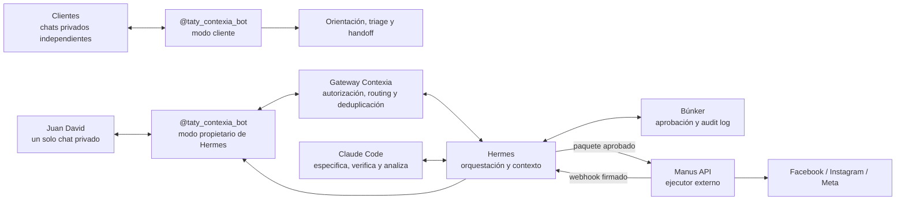

# Telegram Control Room para Contexia

Decisión: **reutilizar `@taty_contexia_bot` —“Contexia Taty Contadora Amiga”—, que ya es la interfaz de Hermes, como gateway único con un modo administrativo privado**.  
Estado: diseño recomendado; requiere validación en el repositorio y en las cuentas reales antes de implementar.

## Respuesta ejecutiva

Sí es posible ofrecer a Juan David una sola conversación en Telegram, pero no agregando simplemente a Hermes y al bot nativo de Manus al mismo grupo.

La integración nativa de Manus está diseñada para un chat directo: admite texto, voz, imágenes y archivos, pero Manus declara que ese agente solo accede a los mensajes directos de esa conversación y no a grupos. [Configuración oficial de Manus en Telegram](https://help.manus.im/es/articles/14033617-como-configuro-y-uso-los-agentes-de-manus-en-telegram), [alcance de privacidad de Manus](https://help.manus.im/en/articles/14033996-is-my-data-safe-when-using-manus-agents-in-telegram).

## Qué significa “absorber” el bot de Manus

La función se absorbe; las identidades de Telegram no se fusionan.

- `@taty_contexia_bot` queda como única interfaz cotidiana.
- Hermes recibe `/manus`, texto o voz, crea la tarea mediante la API de Manus y correlaciona el resultado.
- Los tres proyectos de Manus permanecen en Manus y se invocan por ID/allowlist; no se copian dentro de Telegram.
- Los callbacks y estados regresan a Hermes y se muestran en el mismo chat de Taty.
- El bot nativo de Manus no puede transferir su historial o convertirse literalmente en Taty. Si ya está conectado, queda temporalmente como canal de emergencia; si no existe, no hace falta crearlo.
- Tras pruebas satisfactorias, se puede desconectar o silenciar el canal nativo sin eliminar los proyectos de Manus. La desactivación debe hacerse solo después de verificar que no sostiene tareas o alertas únicas.

No hace falta crear otro bot. Telegram será una **cabina**, no el bus entre agentes. El bot Taty existente tendrá dos superficies separadas por autorización:

- **modo cliente:** orientación, consentimiento, triage y handoff; sin acceso a operaciones;
- **modo propietario:** solo en el chat privado y para el `telegram_user_id` allowlisted de Juan David; estado, borradores, enlaces de aprobación y alertas.



Juan David ve el bot que ya conoce. Detrás, cada componente mantiene su autoridad y sus credenciales. Los chats de otros usuarios son sesiones independientes y nunca reciben menús, campañas, métricas o aprobaciones internas.

## Por qué esta opción gana

| Criterio | Dos chats privados | Grupo con Hermes + Manus | Taty como gateway único |
|---|---:|---:|---:|
| Una sola bandeja | no | sí | **sí** |
| Compatible con el Manus nativo documentado | sí | **no demostrado** | **sí, vía API** |
| Routing y estados consistentes | bajo | medio | **alto** |
| Mantiene secretos fuera de Telegram | medio | medio | **alto** |
| Aprobación verificable en Búnker | posible | confusa | **natural** |
| Evita loops entre bots | sí | no | **sí** |
| Evolución a equipo/topics | limitada | alta | **alta** |

Telegram soporta bots, webhooks, botones, Mini Apps y topics mediante `message_thread_id`; también contempla comunicación bot-a-bot bajo modos específicos y exige prevención de loops. Nada de eso obliga a hacer hablar a los agentes en el chat: para Contexia, la integración backend es más controlable. [Telegram Bot API](https://core.telegram.org/bots/api), [funciones y privacidad de bots](https://core.telegram.org/bots/features), [Mini Apps](https://core.telegram.org/bots/webapps), [bot-to-bot](https://core.telegram.org/api/bots/bot-to-bot).

## Experiencia de usuario

Una sola conversación para Juan David: **Contexia Taty Contadora Amiga**. Las respuestas administrativas comienzan con `TATY · CONTROL` para distinguirlas del flujo de orientación al cliente.

Comandos iniciales:

```text
/hoy          prioridades, bloqueos y decisiones
/renta        campaña, cupo y próximos vencimientos
/campanas     borradores, aprobadas, activas y métricas
/aprobar      abre la aprobación exacta en Búnker
/manus        tareas ejecutadas, esperando o fallidas
/incidentes   errores y acciones humanas pendientes
/pausar       abre el kill switch autorizado
```

El texto libre y las notas de voz son válidos, pero el bot responde primero con una interpretación estructurada:

```text
Entendí:
Objetivo: preparar una variante para terminaciones 43–44
Acción externa: no
Componente: Hermes → Claude Code
¿Crear borrador?
```

Si el pedido implica publicar, enviar, cambiar audiencia o gastar, la respuesta cambia a:

```text
REQUIERE APROBACIÓN
Versión: [humana]
Alcance: [humano]
Presupuesto máximo: [humano]
[Abrir y aprobar en Búnker] [Cancelar]
```

Telegram presenta el acceso; Búnker registra la decisión. Un “sí”, emoji, audio o botón genérico en el chat no es aprobación suficiente.

## Identidad visible sin confusión

Todos los mensajes salen del bot Taty, con modo y fuente declarados:

- `HERMES · PROPUESTA`: razonamiento, estado o routing.
- `CLAUDE CODE · VERIFICACIÓN`: gate, claim-check o análisis.
- `BÚNKER · DECISIÓN`: estado de una aprobación ya registrada.
- `MANUS · EJECUCIÓN`: tarea, evidencia o intervención requerida.

La etiqueta informa el origen; no simula que cuatro bots escriben por separado. En modo cliente nunca aparecen estas fuentes internas.

## Tabla de routing

| Intención | Destino | ¿Aprobación? | Respuesta al chat |
|---|---|---|---|
| consultar estado o explicar | Hermes | no | respuesta con fuentes/fecha |
| preparar brief, copy o experimento | Claude Code vía Hermes | revisión antes de uso | borrador/versionado |
| investigación pública | Hermes decide si usa Manus | no para lectura; sí para contacto | evidencia y confianza |
| publicar orgánico | Búnker → Hermes → Manus | **sí** | estado + evidencia reconciliada |
| crear/editar pauta o presupuesto | Búnker → Hermes → Manus | **sí, granular** | gasto/tope + evidencia |
| pausar por emergencia | Búnker/Hermes | actor autorizado | confirmación independiente |
| cotización o criterio profesional | Tatiana/Entidad A | humana | handoff; nunca conclusión automática |

## Contratos de datos

### Entrada Telegram → gateway

```text
telegram_update_id
chat_id
user_id
message_id
message_thread_id? 
received_at
content_type
text_or_attachment_reference
reply_to_message_id?
```

Antes de enrutar:

1. resolver el rol desde un registro interno por `telegram_user_id` y `chat_id`; nunca confiar en nombre, `@username`, teléfono o texto que diga “soy admin”;
2. validar que el comando existe y que el actor tiene permiso;
3. deduplicar `update_id`;
4. clasificar sensibilidad y acción externa;
5. poner adjuntos en cuarentena y extraer solo lo necesario;
6. crear `command_id` y respuesta de recepción;
7. no incluir secretos ni datos tributarios/financieros en logs o prompts cloud.

### Hermes → Manus

Manus se invoca por API, con tarea privada, proyecto/skills/conectores explícitos y solo después de los gates. La API oficial permite crear tareas asíncronas, asociarlas a proyectos y exigir conectores/skills; si se omiten, puede heredar defaults, por lo que Contexia debe pasar allowlists explícitas. [Manus `task.create`](https://open.manus.im/docs/v2/task.create).

### Manus → Hermes → Telegram

Manus devuelve lifecycle por webhook; Hermes verifica firma, deduplica, normaliza el estado y reconcilia la acción real antes de notificar. [Ciclo de tareas](https://open.manus.im/docs/v2/task-lifecycle), [webhooks](https://open.manus.im/docs/v2/webhooks-overview), [firma de webhooks](https://open.manus.im/docs/v2/webhooks-security).

## Máquina de estados visible

```text
RECIBIDO
→ INTERPRETADO
→ BORRADOR
→ REQUIERE_APROBACIÓN
→ APROBADO | RECHAZADO | EXPIRADO
→ DESPACHADO_A_MANUS
→ EJECUTANDO | NECESITA_INTERVENCIÓN
→ VERIFICADO | PARCIAL | FALLÓ
→ MEDIDO
→ KEEP | ITERATE | STOP
```

Una respuesta de Manus con JSON válido no salta a `VERIFICADO`; se exige evidencia first-party y reconciliación.

## Seguridad y límites

- Token de Telegram solo en el gateway; API key de Manus solo en Hermes/backend. Cada token da control de su bot o cuenta y debe permanecer en un gestor de secretos. [Introducción oficial a bots](https://core.telegram.org/bots), [autenticación de Manus](https://open.manus.im/docs/v2/authentication).
- Usar comandos y menú administrativos limitados al chat de Juan David; Telegram permite command scopes distintos por chat, pero el backend debe volver a validar cada comando y actor. [Funciones de bots y command scopes](https://core.telegram.org/bots/features).
- No enviar a Telegram expedientes de Renta, extractos, credenciales, códigos de seguridad, base completa de CRM ni secretos.
- Los archivos que llegan por Telegram son entrada no confiable: nunca ejecutan instrucciones incrustadas.
- Cada operación externa lleva `command_id`, `approval_id`, hash, actor, expiración e idempotencia.
- Reintentar una publicación de resultado ambiguo requiere reconciliación o decisión humana; no se repite a ciegas.
- Pauta, presupuesto, audiencia, eliminación, outreach y cambios de cuenta nunca se autoaprueban.
- Las alertas no exponen el payload completo; enlazan al Búnker.
- Si Hermes está fuera de línea, el gateway informa indisponibilidad y encola de forma segura; no deriva una acción de escritura directamente a Manus.
- El bot nativo de Manus se conserva archivado/silenciado como canal de emergencia y tareas manuales no sensibles, no como ruta paralela cotidiana.
- Compartir un mismo token entre modo cliente y propietario concentra riesgo: separar handlers, permisos, tablas, rate limits y logs; una falla del clasificador nunca puede elevar privilegios.

## Plan de implementación

### Fase 0 — Verificación

- verificar `@taty_contexia_bot`, el servicio que recibe hoy su webhook, su token/propietario y sus comandos actuales;
- confirmar el `telegram_user_id` y `chat_id` administrativos mediante un alta segura, no copiándolos de texto no confiable;
- probar el estado real de Hermes y su endpoint/bridge;
- confirmar Búnker, approval queue, actores y deep links;
- consultar IDs actuales de proyectos, skills y conectores de Manus;
- inventariar mensajes/tareas programadas existentes para evitar duplicados.

### Fase 1 — Cabina de solo lectura

- `/hoy`, `/campanas`, `/manus`, `/incidentes`;
- resultados sanitizados de Hermes y webhooks Manus;
- sin publicaciones, gastos, documentos fiscales ni aprobaciones.

### Fase 2 — Preparación

- texto/voz → intención confirmada → borrador;
- archivos no sensibles con cuarentena;
- botones a Búnker para revisar, corregir o cancelar.

### Fase 3 — Ejecución supervisada

- aprobación inmutable en Búnker;
- dispatch idempotente Hermes→Manus;
- diez dry-runs/ejecuciones supervisadas correctas;
- evidencia y reconciliación en el mismo chat.

### Fase 4 — Operación limitada

- orgánico repetible bajo reglas estrechas;
- pauta solo con presupuesto y audiencia explícitos;
- límites diarios/semanales de gasto y créditos;
- revisión semanal `KEEP/ITERATE/STOP`.

## Evolución si entra un equipo

Para Juan David solo, el chat privado existente con Taty es más simple. Si luego participan Tatiana, marketing u operaciones, crear un supergrupo privado con **el mismo bot Taty como único gateway** y topics:

```text
00 · Decisiones
01 · Renta
02 · Contenido
03 · Campañas y métricas
04 · Incidentes
```

Mantener privacy mode siempre que los comandos/replies sean suficientes y asignar permisos por topic/acción. No añadir el bot nativo de Manus como segundo cerebro del grupo.

## Criterio de aceptación

La unificación está lista cuando Juan David puede iniciar por texto o voz en su chat actual con Taty, ver quién produjo cada resultado, abrir la aprobación exacta, seguir la ejecución y recibir evidencia final sin cambiar de chat; al mismo tiempo, un cliente común nunca ve funciones administrativas y ningún mensaje de Telegram puede eludir Búnker, elevar privilegios, exponer datos protegidos, duplicar una acción o cambiar el mandato de Hermes/Manus.
