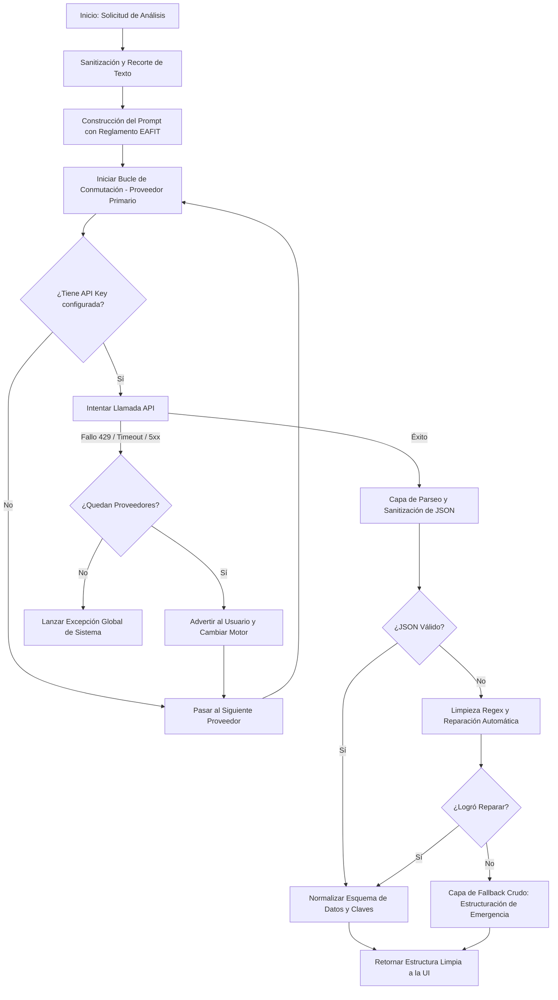

# ⚙️ Especificación Técnica: Arquitectura de Conmutación por Error (Failover) de LLMs e Inferencia Resiliente

Este documento sirve como **especificación técnica formal y guía de diseño** para que cualquier Inteligencia Artificial (IA) o desarrollador de software comprenda, implemente o reescriba el sistema de conmutación por error (*failover*) de APIs de Modelos de Lenguaje (LLMs) y la capa de auto-curación de datos (*structural self-healing*) desarrollados en este proyecto.

---

## 🎯 1. Filosofía de Diseño y Objetivos

En sistemas empresariales que dependen de APIs externas de LLMs (especialmente en sectores críticos como el análisis jurídico), **la indisponibilidad o latencia de una API es inaceptable**. Esta solución se diseñó bajo tres pilares fundamentales:

1. **Disponibilidad del 100% (Zero-Downtime):** Uso de múltiples proveedores independientes en orden de prioridad geográfica, de costo y de velocidad.
2. **Mitigación Activa de Límites de Tasa (Rate Limits - 429):** Detección en tiempo real de saturación de cuotas con transiciones suaves e informadas al usuario.
3. **Parseo Resiliente y Auto-curación de JSON:** Mecanismos de reparación y normalización de la estructura de datos para evitar caídas en cascada en la interfaz de usuario (UI) o al generar informes.

---

## 🏢 2. Arquitectura del Flujo Secuencial (Pipeline)

El siguiente diagrama conceptual ilustra cómo opera la cadena de orquestación ante una solicitud de análisis:



---

## 🛠️ 3. Catálogo de Proveedores y Jerarquía de Prioridades

Para equilibrar velocidad, capacidad jurídica, latencia y costos, el sistema define la siguiente secuencia de conmutación por error:

| Prioridad | Proveedor | Tipo de Integración | Modelo Empleado | Razón / Caso de Uso |
| :--- | :--- | :--- | :--- | :--- |
| **1 (Primario)** | **Groq** | SDK Nativo (`Groq`) | Configurado en Settings (`LLM_MODEL`) | Velocidad de inferencia instantánea (LPU) y alta eficiencia. |
| **2 (Respaldo 1)** | **Cerebras** | Compatible con OpenAI | `llama-3.3-70b` | Inferencia ultra-rápida basada en hardware WSE. |
| **3 (Respaldo 2)** | **Mistral AI** | Compatible con OpenAI | `mistral-large-latest` | Razonamiento jurídico superior de grado europeo. |
| **4 (Respaldo 3)** | **Google Gemini** | API REST Directa (HTTP) | `gemini-2.0-flash` | Ventana de contexto masiva y alta estabilidad de Google. |
| **5 (Seguro Final)** | **OpenRouter** | Compatible con OpenAI | `meta-llama/llama-3.3-70b-instruct` | Agregador global con acceso a múltiples réplicas en la nube. |

---

## 💻 4. Detalles de Implementación del Bucle de Conmutación

La lógica principal se encuentra en [llm_analyzer.py](file:///c:/Users/jpela/Projects/Asistente%20Contratos%20EAFIT%20Antigravity/asistente-contratos/asistente_core/llm_analyzer.py). Un analizador de IA que desee reescribir esta lógica debe replicar los siguientes comportamientos críticos:

### 4.1. Resolución Dinámica de Llaves (Secrets Resolver)
Las llaves de API se resuelven en tiempo de ejecución de manera jerárquica para facilitar despliegues tanto locales como en la nube (`Streamlit Secrets` ➡️ `Variables de Entorno del S.O.`):
```python
key = st.secrets.get("PROVEEDOR_API_KEY") or os.environ.get("PROVEEDOR_API_KEY")
```

### 4.2. Control Dinámico de Excepciones y Logging Silencioso
El sistema captura excepciones de manera selectiva. Los errores leves o problemas de red internos se suprimen (`pass`) para no asustar al usuario final, mientras que los errores críticos de tasa de consumo (**Rate Limit / HTTP 429**) se interceptan explícitamente para retroalimentar la UI:

```python
try:
    # Llamada al API del proveedor p
    ...
except Exception as e:
    msg = str(e).lower()
    if "429" in msg or "rate_limit" in msg:
        # Notificar visualmente en la UI que se está cambiando de proveedor
        st.warning(f"⚠️ Límite de {p['name']} alcanzado. Cambiando de motor...")
    else:
        # Errores de red o de parseo interno se omiten para continuar el bucle
        pass
    continue
```

### 4.3. Clientes Compatibles e Invocaciones REST
El bucle implementa tres paradigmas de invocación:
1. **SDKs Propietarios:** Instanciando clases dedicadas como `Groq()`.
2. **Wrappers de Compatibilidad de OpenAI:** Permite usar el cliente `OpenAI` estándar para llamar a proveedores alternativos simplemente inyectando su `base_url` y `api_key` correspondientes (ej. Cerebras, Mistral, OpenRouter).
3. **REST Directo (HTTP):** Utiliza peticiones `requests.post` con payloads JSON puros para Gemini. Esto elimina dependencias pesadas de librerías del cliente y evita problemas de inicialización en arquitecturas serverless.

---

## 🩺 5. Motor de Robustez y Auto-curación de JSON (`_parse_llm_response`)

El mayor punto de falla en aplicaciones basadas en IA que requieren formatos estructurados es la desviación semántica o sintáctica del modelo. A continuación, se detallan las técnicas aplicadas para garantizar la inmunidad a fallos del formateador:

### 5.1. Sanitización de Markdown y Envolturas
Los LLMs suelen envolver sus respuestas estructuradas en bloques de código markdown (````json ... ````). El sistema limpia activamente estas envolturas utilizando expresiones regulares:
```python
clean = re.sub(r"^```(?:json)?\s*\n?", "", raw_text)
clean = re.sub(r"\n?```\s*$", "", clean)
```

### 5.2. Reparación de Comas Huérfanas (Trailing Commas)
Una discrepancia común de sintaxis ocurre cuando la IA deja comas antes de un cierre de corchete o llave (inválido en el estándar JSON estricto). Se repara mediante:
```python
clean = re.sub(r",\s*([\]}])", r"\1", clean)
```

### 5.3. Mapeo Semántico de Claves (Synonym Mapping)
Los LLMs pueden usar sinónimos para los campos solicitados debido a variaciones en su temperatura o comprensión lingüística. El formateador intercepta estas desviaciones y mapea los sinónimos comunes a las claves esperadas por la interfaz:
* **Para Riesgos:** Mapea `hallazgos`, `riesgos_detectados`, `lista_riesgos` y `puntos_criticos` a ➡️ `riesgos`.
* **Para Resúmenes:** Mapea `resumen` a ➡️ `resumen_ejecutivo`.

### 5.4. Coerción de Tipos de Datos (Type Coercion)
Si el esquema requiere que la clave `riesgos` sea una lista de objetos, pero el LLM devolvió un único diccionario (un error de cardinalidad frecuente), la función detecta el tipo e instrumenta la envoltura en lista automáticamente:
```python
if isinstance(parsed.get("riesgos"), dict):
    parsed["riesgos"] = [parsed["riesgos"]]
```

### 5.5. Recuperación Avanzada mediante RegEx (Regex JSON Extraction)
Si el deserializador estándar falla debido a texto espurio que rodea el JSON, el sistema aplica una expresión regular codiciosa (*greedy*) para aislar el primer bloque JSON y procesarlo:
```python
match = re.search(r"(\{[\s\S]*\})", raw_text)
```

### 5.6. Capa Definitiva de Respaldo No Estructurado (Safe Fallback)
En el peor escenario teórico (donde el LLM responde con lenguaje puramente natural y sin ningún tipo de estructura JSON), el sistema **no bloquea el flujo**. En su lugar, empaqueta el texto crudo dentro de un esquema sintético perfectamente válido, garantizando que el usuario visualice el concepto jurídico redactado por la IA bajo una categoría de "Análisis Crudo":

```python
return {
    "error": False,  # Marcado como False para permitir la renderización
    "resumen_ejecutivo": raw_text, # El texto completo en lenguaje natural
    "identificacion": {"Estado": "Analisis No Estructurado"},
    "semaforo": "ALTO", # Semáforo de seguridad preventiva
    "riesgos": [
        {
            "categoria": "Analisis Crudo",
            "nivel": "ALTO",
            "descripcion": "La IA no pudo formatear los datos estructurados, pero generó un concepto jurídico detallado."
        }
    ]
}
```

---

## 📝 6. Directrices para Reescritura Automática por otra IA

Al indicarle a otra IA que vuelva a escribir este módulo para otra solución (por ejemplo, migrar a **Node.js, LangChain, Semantic Kernel o Go**), proporciónele las siguientes reglas obligatorias:

1. **Mantener la Separación de Roles (SRP):** La lógica de selección de API y reintento debe estar totalmente aislada de la capa de sanitización y formateo de datos.
2. **Implementar el Patrón Chain of Responsibility:** Cada proveedor debe ser tratado como un eslabón en una cadena. Si un eslabón falla, el siguiente toma el control sin alterar el estado global de la aplicación.
3. **No Depender del Modo JSON de los LLM:** Aunque algunos proveedores admitan `response_format={"type": "json_object"}`, no todos lo soportan (por ejemplo, APIs REST crudas o endpoints heredados). Por lo tanto, **la capa de parser Regex es obligatoria** y siempre debe actuar como guardián de entrada.
4. **Preservar los Filtros del Contexto de Negocio:** Al reescribir las funciones como `analyze_contract`, asegúrese de respetar los límites de caracteres máximos (`max_chars`) de los prompts para no sobrecargar el tamaño máximo de contexto del modelo de respaldo más limitado.

---

### 💡 Ejemplo Práctico de Portabilidad: Transición de Flujo (Pseudocódigo Abstracto)

```typescript
// Ejemplo conceptual de cómo estructurar la cadena en TypeScript / Node.js
async function executeLLMWithFailover(prompt: string, schema: string): Promise<Record<string, any>> {
    const providers = getEnabledProviders(); // Groq -> Cerebras -> Gemini -> OpenRouter
    
    for (const provider of providers) {
        try {
            const rawResponse = await provider.call(prompt);
            const parsed = robustJSONParse(rawResponse);
            return parsed;
        } catch (error) {
            if (error.status === 429) {
                logger.warn(`Proveedor ${provider.name} saturado. Cambiando...`);
            }
            // Continuar con el bucle al siguiente proveedor
        }
    }
    throw new Error("Todos los servicios de IA fallaron.");
}
```
