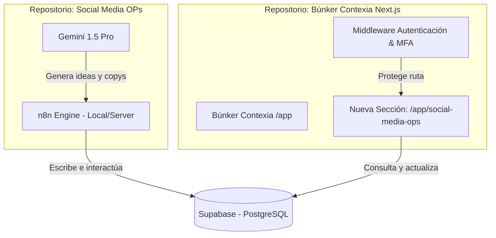

# Arquitectura de Integración: Social Media OPs en Búnker Contexia

---

## 1. El Reto
Integrar el sistema operativo de contenidos orgánicos ("Social Media OPs Systems") en el portal administrativo existente del operador: **Búnker Contexia** (`https://contexia.online/app`), garantizando:
1. **Seguridad y Acceso:** Reutilizar el login actual, la gestión de roles y la autenticación multifactor (MFA) del Búnker sin duplicar infraestructura.
2. **Consistencia Visual:** Mantener la estética premium (modo oscuro, azul Contexia) que ya tiene el portal de clientes.
3. **Independencia de Código:** Permitir que los dos proyectos residan en carpetas o repositorios diferentes si es necesario, pero desplegándose bajo el mismo dominio de producción en Vercel.

---

## 2. Estrategia de Arquitectura: Monolito de Despliegue con Base de Datos Compartida

La mejor práctica para este escenario es utilizar una **Arquitectura de Base de Datos Compartida e Integración a Nivel de Ruta**.



---

## 3. ¿Cómo funciona la integración?

### A. Capa de Datos Única (Supabase)
Tanto la automatización de **n8n** como el frontend del **Búnker Contexia** se conectan al mismo proyecto de Supabase (`wzqymuzpjbagnbgsiqig`).
- n8n corre en segundo plano como el motor operativo (ingesta de ideas, generación de borradores, cálculo de métricas).
- La sección administrativa del Búnker sirve como la **interfaz visual** para que el operador y los analistas vean y editen esos datos.

### B. Herencia de Autenticación y MFA
Al crear la nueva sección como una ruta interna del Búnker (`/app/social-media-ops` o `/app/ops`):
1. **Acceso Protegido:** El Middleware existente en el Búnker intercepta cualquier acceso a `/app/*`. Si el usuario no está logueado o no ha completado el MFA, es redirigido al login común del Búnker.
2. **Cero Setup de Auth:** No tienes que programar tokens, cookies ni flujos de MFA para el módulo de contenidos. Heredas la seguridad empresarial ya construida en el Búnker de forma 100% transparente.

### C. Despliegue en contexia.online/app
Para que no tengas que desplegar el Content OS en un subdominio gratuito de Vercel separado:
1. En el repositorio del **Búnker Contexia** (tu proyecto principal de Next.js), se crea una carpeta de ruta: `src/app/app/social-media-ops/page.tsx` (si usas App Router) o `pages/app/social-media-ops.tsx` (si usas Pages Router).
2. Se agrega la librería cliente de Supabase al proyecto del Búnker:
   ```bash
   npm install @supabase/supabase-js
   ```
3. Se configuran las variables de entorno del Búnker en Vercel con la URL y la Anon Key del Supabase del Content OS:
   ```env
   NEXT_PUBLIC_SUPABASE_OPS_URL=https://wzqymuzpjbagnbgsiqig.supabase.co
   NEXT_PUBLIC_SUPABASE_OPS_ANON_KEY=eyJhbGciOiJIUzI1NiIsInR5c...
   ```
4. Se añade un nuevo botón o enlace en la barra de navegación lateral del Búnker (abajo de "Búnker Admin" o en las secciones de gestión de clientes) que redirija a `/app/social-media-ops`.

---

## 4. UI/UX: Integración del Módulo en el Dashboard

La nueva sección `Social Media OPs Systems` se verá como una pestaña o módulo nativo dentro del Búnker actual.

### Vistas recomendadas para implementar en el Búnker:
1. **Backlog de Ideas (Kanban):** Un tablero interactivo para arrastrar ideas de `NUEVA` a `SELECCIONADA`.
2. **Calendario Semanal:** Una vista donde los analistas pueden ver qué posts están programados para la semana y su estado (`PLANIFICADO`, `DRAFT`, `APPROVED`, etc.).
3. **Editor de Borradores (Draft Review):** Una pantalla limpia para leer los borradores generados por Gemini, editarlos y hacer clic en el botón "Aprobar y Programar".
4. **Dashboard de Analítica:** Gráficas de rendimiento que consulten directamente la vista `dashboard_semanal` de Supabase para ver el Engagement Rate de las publicaciones.

---

## 5. Plan de Acción para la Integración

| Fase | Tarea | Responsable | Resultado esperado |
|:-----|:------|:------------|:-------------------|
| **Fase 1** | Ejecución de Schema en Supabase | AI Agent | Estructura de base de datos lista |
| **Fase 2** | Creación de Rutas en Repositorio Búnker | Humano (con mi guía) | `/app/social-media-ops` responde bajo auth y MFA |
| **Fase 3** | Conexión Supabase cliente en Next.js | AI Agent / Humano | El frontend lee la lista de ideas y calendario |
| **Fase 4** | Diseño UI Dark Mode en Búnker | AI Agent | Dashboard integrado visualmente consistente con el Búnker |
